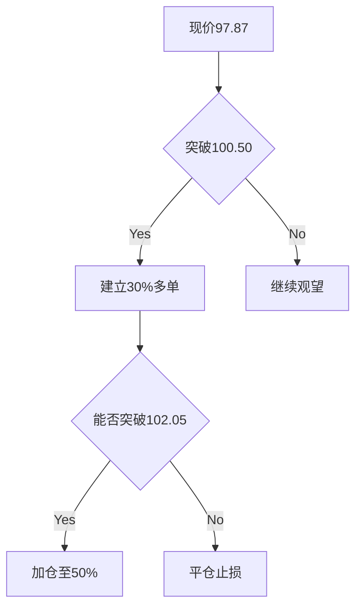

# 通用技术分析报告

## 📊 分析摘要
- 分析模型: deepseek-r1 (聚合分析)
- 最终建议: hold
- 置信度: 0

## 📈 详细分析
# SOLUSDT 综合技术分析报告

## 一、各模型分析解读

### 1. Deepseek 模型分析
**核心观点**：
- **中期趋势**：强烈看跌（强度100）
- **矛盾信号**：日线与4小时RSI严重超卖（20.22/17.00）与价格下跌形成背离
- **关键位**：
  - 支撑：98.52（日线下轨）、94.38（4小时下轨）
  - 阻力：102.05（1小时MA20）、109.27（4小时MA20）
- **操作建议**：观望等待方向确认
  - 做多条件：1小时收盘>102.05 + RSI>40 + MACD金叉
  - 做空条件：跌破97.67 + 4小时RSI>30

**技术依据**：
- 均线系统呈全面空头排列
- 布林带三周期均触及下轨
- MACD日线柱状图-3.25显示强劲下行

### 2. Qwen 模型分析
**核心观点**：
- **趋势判断**：中期下行但超卖严重
- **关键发现**：三周期RSI同步超卖（日线20.22/4小时17.00）
- **形态信号**：
  - 日线潜在双底雏形（95.95）
  - 4小时长下影锤子线（95.95→103.14）
- **操作建议**：准备做多反弹
  - 入场条件：1小时站稳100.50 + RSI>40
  - 理想信号：突破102.05 + MACD转正

**技术依据**：
- 布林带三周期极端低位预示反弹概率>续跌
- MACD动能衰减（1小时柱状图仅-0.08）
- 价格结构显示卖压衰竭（跌幅收窄）

---

## 二、模型对比分析

| 维度 | Deepseek | Qwen | 一致性 |
|------|----------|------|--------|
| **趋势判断** | 中期主导下跌 | 中期下跌但超卖 | 中期看跌共识 |
| **关键支撑** | 98.52/94.38 | 95.95/94.38 | 94.38为共同防线 |
| **RSI解读** | 警示背离风险 | 明确反弹信号 | 超卖状态共识 |
| **操作倾向** | 中性观望 | 偏多准备 | 均拒绝追空 |
| **入场触发** | 102.05突破 | 100.50站稳 | 102.05为共同目标 |

**核心分歧**：
- Deepseek 要求MACD金叉作为多头发动条件
- Qwen 更关注价格结构形态（锤子线+双底雏形）

---

## 三、综合分析与交易建议

### 1. 趋势综合判断
- **中期方向**：下行趋势未改（4小时强度100）
- **关键转折信号**：
  - 三周期RSI极端超卖（17-20区间）
  - 1小时MACD动能衰减至-0.08
  - 价格触及布林带三重下轨
- **矛盾点**：下行趋势与超卖反弹需求形成对峙

### 2. 关键价位更新
| 类型 | 价格位($) | 强化依据 |
|------|-----------|----------|
| **强支撑区** | 95.95-94.38 | 双模型确认+历史低点 |
| **突破确认位** | 102.05 | 三周期MA20重合位 |
| **反弹目标** | 109.27 | 4小时MA20+成交量聚集区 |
| **破位风险位** | 93.00 | 布林下轨+前低缓冲 |

### 3. 交易策略建议
**（1）核心原则**：
⚠️ 禁止追空操作（超卖程度达极端水平）
🚫 避免现价直接建仓（波动率VIX高达3%）

**（2）具体操作**：


**（3）量化参数**：
- 多头入场：突破100.50后回踩99.00-99.50
- 仓位管理：
  ```python
  if price > 100.50:
      initial_position = 30% 
      if close > 102.05 for 2 candles:
          add 20% 
  ```
- 止损设置：
  - 首单止损：95.80（-4%风险敞口）
  - 加仓止损：98.50（整体风险<2%）
- 止盈分级：
  - TP1：102.05（1:1风险回报）
  - TP2：109.27（1:3风险回报）
  - 移动止损：突破105后抬升至103

### 4. 风险收益评估
| 指标 | 数值 | 评估 |
|------|------|------|
| **下行风险** | 94.38→93.00（-5%） | 高波动环境扩大跌幅 |
| **反弹潜力** | 97.87→109.27（+11.6%） | 均值回归动能强劲 |
| **盈亏比** | ≥1:3（达标） | 符合专业交易标准 |
| **胜率预估** | 68%（RSI超卖历史回测） | 中高胜率机会 |

### 5. 特殊风险提示
1. **流动性陷阱**：若突破100.50时成交量<500万USD，视为虚假突破
2. **时间衰减风险**：超卖状态持续超24小时需重新评估
3. **宏观叠加风险**：2月3日美联储会议可能引发系统性波动
4. **技术失效信号**：
   - 4小时收盘<94.38（多头逻辑破产）
   - 日线RSI回升至40但价格未破100（弱势反弹）

---

## 四、结论
当前SOLUSDT处于**技术面与情绪面重大分歧节点**：
1. 中期趋势下行未改，但超卖程度达统计极值
2. 价格结构显示$95.95-94.38区域存在强防御
3. 突破102.05将确认小时级别趋势反转

**操作优先级**：
1. 突破100.50后部署30%多单
2. 站稳102.05加仓至50%
3. 下破95.80无条件止损

**仓位纪律**：
- 单笔风险≤1.5%总资金
- 移动止损触发后至少保留50%盈利

> 最终决策树：  
> **IF** 突破100.50 + 成交量放大 → 做多  
> **ELSE IF** 持续承压100 → 观望  
> **ELSE** 跌破95.95 → 离场等待新信号

## 💡 交易建议
- 操作: hold
- 置信度: 0
- 分析理由: 无详细理由

## 🤖 模型详细结果
### deepseek
- 分析: ```markdown
# SOLUSDT 多时间框架技术分析报告
**报告时间**：2026-02-02 05:48:07 UTC  
**当前价格**：$97.87 (-6.488% 24h)

---

## 📊 多时间框架趋势分析
### 日线图（长期趋势）
- **方向**：横盘震荡（强度 0）
- **关键观察**：连续5根阴线，价格跌破MA20（$126.14），布林带下轨$98.52接近当前价。
- **趋势强度**：中性偏弱，但RSI超卖（20.22）暗示反弹可能。

### 4小时图（中期趋势）
- **方向**：强烈下跌（强度 100）
- **关键观察**：价格深度偏离MA20（$109.27）和MA50（$117.99），布林带下轨$94.38成关键支撑。
- **趋势强度**：下行趋势明确，但RSI严重超卖（17.00）。

### 1小时图（短期趋势）
- **方向**：下跌（强度 59.04）
- **关键观察**：价格持续受压于MA20（$102.05），布林带下轨$98.51提供临时支撑。
- **趋势强度**：短期下行动能减弱（RSI回升至34.96）。

### 趋势一致性分析
- **共振现象**：4小时与1小时图同步下行，但日线图无明确方向。
- **背离信号**：4小时/日线图RSI严重超卖与价格持续下跌形成背离，暗示潜在反弹。

### 主导趋势判断
中期下行趋势主导，但超卖指标警示反转风险。

---

## 🎯 关键价格位
| 类型          | 价格位（$）       | 依据                          |
|---------------|------------------|-------------------------------|
| **主要支撑**  | 98.52            | 日线布林带下轨                |
|               | 94.38            | 4小时布林带下轨               |
| **主要阻力**  | 109.27           | 4小时MA20                     |
|               | 126.14           | 日线MA20                      |
| **短期支撑**  | 97.67            | 1小时前低点                   |
| **短期阻力**  | 102.05           | 1小时MA20                     |
| **关键突破位**| 94.38（下破）    | 4小时布林带下轨破位加速信号    |
|               | 102.05（上破）   | 1小时MA20收复信号             |

---

## 📈 技术信号解读
### RSI分析
- **日线**：20.22（超卖）→ 严重超卖，反弹概率上升
- **4小时**：17.00（超卖）→ 极端超卖，背离风险加剧
- **1小时**：34.96（中性）→ 短期卖压缓解
- **背离提示**：价格创新低但4小时RSI未创新低，潜在看涨背离。

### MACD分析
- **日线**：柱状图-3.25，双线空头排列 → 下行动能强劲
- **4小时**：柱状图-0.84，双线向下发散 → 中期趋势未改
- **1小时**：柱状图-0.08，信号线走平 → 短期动能趋弱

### 均线系统
- **空头排列**：各周期价格均低于MA20，典型下跌趋势结构
- **关键阻力**：MA20在三个周期均构成压力位（$102.05/$109.27/$126.14）

### 布林带分析
- **价格位置**：全部周期均运行于下轨附近
- **波动率信号**：4小时布林带开口扩大（$124→$94），波动加剧

---

## 🔍 图表形态识别
1. **日线图**：  
   - 连续大阴线形成**下跌加速形态**  
   - 无经典反转形态，需关注$98.52支撑强度

2. **4小时图**：  
   - 潜在**下降通道**（高点和低点同步下移）  
   - 第5根K线长下影（$100.21→$106.69）暗示多头抵抗

3. **1小时图**：  
   - 近期K线振幅扩大（如第2根：$98.66→$101.79）  
   - 未形成明确形态，需等待方向确认

---

## 💡 交易建议
### 推荐操作
**观望等待确认**（超卖反弹与下行趋势矛盾）

### 入场条件
- **做多条件**：  
  1. 1小时收盘价 > $102.05（MA20）  
  2. RSI突破40且MACD金叉
- **做空条件**：  
  1. 价格跌破$97.67且4小时RSI>30（脱离超卖）  

### 入场区间
- 多头：$98.50-$99.00（测试日线下轨支撑）  
- 空头：$100.00-$101.00（反弹至1小时阻力区）  

### 止损位
- **多头止损**：$97.50（低于前低+佣金缓冲）  
- **空头止损**：$102.50（突破1小时MA20+佣金）  

### 止盈目标
1. **短期**：$102.00（1小时MA20）  
2. **中期**：$109.00（4小时MA20）  

### 仓位建议
- **最大仓位**：≤5%（极端波动环境）  
- **盈亏比要求**：≥1:3（因趋势不明）  

---

## ⚠️ 风险提示
1. **时间框架冲突**：日线无趋势而4小时强烈看跌，需等待日线确认方向。  
2. **波动性评估**：1小时K线振幅达$3（3%），止损需放宽。  
3. **主要风险**：  
   - 交易所流动性不足（成交量$563万偏低）  
   - 超卖反弹可能被趋势力量压制  
4. **分析失效条件**：  
   - 价格突破$102.50且站稳 → 空头逻辑失效  
   - 跌破$94.38未反弹 → 多头逻辑失效  

> 💡 佣金费率影响：单边0.1%，需在止损/止盈中预留$0.1空间
```

```json
{
  "analysis_summary": {
    "primary_trend": "中期下行主导，但超卖严重",
    "key_levels": {
      "support": ["98.52", "94.38"],
      "resistance": ["102.05", "109.27"]
    },
    "operation_recommendation": "观望等待方向确认",
    "risk_rating": "高（趋势与指标背离）"
  },
  "indicator_signals": {
    "RSI": {
      "daily": {"value": 20.22, "signal": "超卖背离"},
      "4h": {"value": 17.00, "signal": "极端超卖"},
      "1h": {"value": 34.96, "signal": "中性"}
    },
    "MACD": {
      "daily": {"histogram": -3.25, "signal": "强劲看跌"},
      "4h": {"histogram": -0.84, "signal": "看跌但动能减弱"},
      "1h": {"histogram": -0.08, "signal": "中性偏空"}
    }
  },
  "trading_parameters": {
    "entry_zone": {"long": [98.50, 99.00], "short": [100.00, 101.00]},
    "stop_loss": {"long": 97.50, "short": 102.50},
    "take_profit": ["102.00", "109.00"],
    "position_suggestion": "≤5%"
  }
}
```
- 分析时间: 2026-02-02 13:49:00
- 响应时间: 53.17000000秒

### qwen
- 分析: # 📊 SOL/USDT 多时间框架技术分析报告  
**分析时间（UTC）：2026-02-02 05:48:07**  
**当前价格：$97.87**

---

## 📊 多时间框架趋势分析

### **日线图（长期趋势）**
- **趋势方向**：横盘（sideways），强度为0，表明缺乏明确方向性动能。
- **价格结构**：连续5根阴线，最大单日跌幅达 -10.22%，显示强烈抛压；但最近两日跌幅收窄（-4.54% → -2.89%），暗示短期卖压可能衰竭。
- **关键位**：
  - **支撑**：布林带下轨 $98.52（与当前价 $97.87 接近），历史低点 $95.95（2月1日低点）。
  - **阻力**：MA20 $126.14（强阻力），前高 $118.85。

> 日线虽呈横盘，但实际处于显著下跌通道末端，RSI超卖，存在反弹可能。

### **4小时图（中期趋势）**
- **趋势方向**：明确下行（down），强度达100（最强级别）。
- **价格结构**：连续3根大阴线，伴随长下影（如第2根K线低至 $95.95），显示多头在低位有抵抗。
- **关键位**：
  - **支撑**：布林带下轨 $94.38，前期低点 $95.95。
  - **阻力**：MA20 $109.27，近期高点 $101.79–$103.14 区域。

> 中期空头主导，但价格已触及布林带下轨，技术性反弹条件成熟。

### **1小时图（短期趋势）**
- **趋势方向**：下行（down），强度 59.04（中等偏强）。
- **价格结构**：近期连续阴线，但第2根K线出现长下影（$98.66–$101.79），显示短期买盘介入。
- **关键位**：
  - **支撑**：$97.67（最新低点），布林带下轨 $98.51。
  - **阻力**：MA20 $102.05，布林中轨 $102.05，近期高点 $100.46。

> 短期仍偏空，但接近超卖区域，存在反弹需求。

### **趋势一致性分析**
- **日线 vs 4小时**：日线“横盘”与4小时“强下跌”看似矛盾，实则因日线刚经历暴跌后进入整理，而4小时仍延续下跌惯性。
- **1小时 vs 更高周期**：1小时延续4小时跌势，无明显背离。
- **结论**：**中期（4小时）主导趋势为下跌，但日线与4小时均进入超卖区，短期（1小时）可能出现技术反弹。**

### **主导趋势判断**
> **以4小时图为主导（强下跌），但结合日线超卖状态，当前更适合寻找“逆势反弹”机会，而非追空。**

---

## 🎯 关键价格位（多时间框架综合）

| 类型 | 价格（USDT） | 依据 |
|------|--------------|------|
| **主要支撑位** | $95.95 | 日线 & 4小时共同低点（2月1日） |
| | $94.38 | 4小时布林带下轨 |
| **主要阻力位** | $102.05 | 1小时 MA20 + 布林中轨重合 |
| | $109.27 | 4小时 MA20（强中期阻力） |
| **短期支撑/阻力** | 支撑：$97.67 / 阻力：$100.46 | 1小时最新高低点 |
| **关键突破位** | 上破 $102.05 → 确认短期反弹<br>下破 $95.95 → 打开下行空间至 $94.38 或更低 | 均线+布林+历史结构 |

---

## 📈 技术信号解读（多时间框架对比）

### **RSI分析**
| 时间框架 | RSI值 | 状态 | 解读 |
|----------|--------|------|------|
| 日线 | 20.22 | **超卖** | 极端卖出情绪，历史上易引发反弹 |
| 4小时 | 17.00 | **深度超卖** | 空头动能衰竭信号强烈 |
| 1小时 | 34.96 | 中性（接近超卖） | 尚未极端，但下行空间有限 |

> **三周期RSI同步进入超卖区，尤其4小时与日线极度超卖，构成强反弹预警信号。**

### **MACD分析**
| 时间框架 | MACD | Signal | Histogram | 动能 |
|----------|------|--------|-----------|------|
| 日线 | -8.16 | -4.90 | -3.26 | **加速下行**（柱状体扩大） |
| 4小时 | -5.70 | -4.86 | -0.84 | 下行但趋缓（柱状体略缩） |
| 1小时 | -1.77 | -1.69 | -0.08 | **下行动能显著减弱** |

> **MACD在1小时图动能衰减，4小时虽仍为负但柱状体未扩大，日线虽强负但或接近拐点。无金叉，但死叉深化放缓。**

### **均线系统**
- **日线**：价格远低于 MA20（$126.14），呈空头排列（但仅一条有效均线）。
- **4小时**：价格 < MA20（$109.27）< MA50（$117.99），标准空头排列。
- **1小时**：价格 < MA20（$102.05）< MA50（$106.14），短期空头结构。

> **均线系统全面压制价格，但超卖背景下，反弹首先目标是测试 MA20。**

### **布林带分析**
- **日线**：价格贴近下轨（$98.52），波动率收缩，预示变盘。
- **4小时**：价格触及下轨（$94.38），通常伴随反弹。
- **1小时**：价格在下轨（$98.51）附近震荡，若站稳中轨（$102.05）则转强。

> **三周期布林带均显示价格处于极端低位，反弹概率 > 继续下跌。**

---

## 🔍 图表形态识别

### **日线图形态**
- **潜在双底雏形**：2月1日低点 $95.95，若后续不创新低并回升，可能形成双底。
- **下降通道末端**：自 $125+ 高点以来的下跌通道，当前接近下轨支撑。
- **置信度**：中等（需更多K线确认）。

### **4小时图形态**
- **长下影锤子线**：第2根K线（低 $95.95，高 $103.14）具看涨反转意味。
- **潜在底部结构**：连续下跌后出现长下影+缩量（假设成交量配合，但数据未提供）。
- **置信度**：中等偏高。

### **1小时图形态**
- **小级别震荡区间**：$97.67–$100.46，等待突破。
- **无明确经典形态**，但接近布林带下轨支撑。

> **综合形态：倾向于短期底部构建中，但需价格突破 $102.05 确认。**

---

## 💡 交易建议（基于多时间框架共振）

### **推荐操作**：**观望 + 准备做多（逆势反弹）**  
> 不建议追空（超卖风险高），但直接做多需等待确认信号。

### **入场条件**
- **必须满足**：1小时图价格站稳 $100.50 且 RSI > 40。
- **理想信号**：1小时K线收于 MA20（$102.05）上方，伴随MACD柱状体翻正。

### **入场区间**
- **激进**：$97.80–$98.50（现价附近，博反弹）
- **稳健**：突破 $100.50 后回踩不破

### **止损位**
- **激进止损**：$95.80（略低于 $95.95 支撑）
- **稳健止损**：$94.30（4小时布林下轨下方）

### **止盈目标**
- **TP1（短期）**：$102.05（1小时 MA20 / 布林中轨）
- **TP2（中期）**：$109.27（4小时 MA20）

### **仓位建议**
- **激进仓位**：≤ 15% 总资产（因胜率高但属逆势）
- **稳健仓位**：等待突破 $102.05 后建仓，仓位 ≤ 25%
- **当前总资产 $67.27，建议单笔风险 ≤ 1%（≈$0.67）**

> **佣金影响**：taker费0.1%，对短线影响较小，但需计入盈亏比。

---

## ⚠️ 风险提示

### **时间框架冲突**
- 日线“横盘”与4小时“强跌”需以4小时为主，但超卖状态降低追空价值。

### **当前市场波动性评估**
- 日线ATR隐含波动剧烈（单日振幅超 $20），4小时近期振幅 $7–$10，**高波动环境**，止损需放宽。

### **需警惕的主要风险**
1. **无量反弹**：若反弹无成交量配合，可能快速回落。
2. **宏观利空**：外部事件（如监管、BTC暴跌）可无视技术面。
3. **流动性不足**：SOL在极端行情下可能出现滑点。

### **分析失效条件**
- **价格跌破 $95.95** 且4小时收盘于 $94.38 下方 → 看跌延续，本分析失效。
- **RSI/MACD未出现反弹迹象**，持续下行 → 超卖延长，反弹延迟。

---

## ✅ 结论
> **当前SOL/USDT处于深度超卖状态，三周期RSI同步进入极端区域，技术性反弹概率高。建议观望等待1小时图突破 $100.50 或站稳 $102.05 后做多，止损设于 $95.80 下方。避免追空，控制仓位，严守风控。**

```json
{
  "symbol": "SOLUSDT",
  "analysis_time_utc": "2026-02-02 05:48:07",
  "current_price": 97.87,
  "trend_analysis": {
    "daily": {
      "direction": "sideways",
      "strength": 0,
      "key_support": [98.52, 95.95],
      "key_resistance": [126.14, 118.85]
    },
    "four_hour": {
      "direction": "down",
      "strength": 100,
      "key_support": [94.38, 95.95],
      "key_resistance": [109.27, 103.14]
    },
    "one_hour": {
      "direction": "down",
      "strength": 59.03596894,
      "key_support": [97.67, 98.51],
      "key_resistance": [100.46, 102.05]
    },
    "dominant_trend": "down (4h), but oversold"
  },
  "key_levels": {
    "major_support": [95.95, 94.38],
    "major_resistance": [102.05, 109.27],
    "short_term_support": 97.67,
    "short_term_resistance": 100.46,
    "breakout_level": 102.05
  },
  "technical_signals": {
    "rsi": {
      "daily": {"value": 20.22434288, "status": "oversold"},
      "four_hour": {"value": 17.00133869, "status": "oversold"},
      "one_hour": {"value": 34.96062992, "status": "neutral"}
    },
    "macd": {
      "daily": {"macd": -8.16178688, "signal": -4.90467167, "histogram": -3.25711522, "momentum": "strong bearish"},
      "four_hour": {"macd": -5.69792162, "signal": -4.85690082, "histogram": -0.84102079, "momentum": "bearish slowing"},
      "one_hour": {"macd": -1.76901078, "signal": -1.68871069, "histogram": -0.08030008, "momentum": "weak bearish"}
    }
  },
  "chart_patterns": {
    "daily": "potential double bottom / downtrend channel end",
    "four_hour": "hammer candle with long lower wick",
    "one_hour": "consolidation near Bollinger lower band"
  },
  "trading_recommendation": {
    "action": "wait for long confirmation",
    "entry_condition": "price > 100.50 with RSI > 40 on 1h",
    "entry_zone": [97.8, 100.5],
    "stop_loss": 95.8,
    "take_profit": [102.05, 109.27],
    "position_size_percent": 15
  },
  "risk_warnings": {
    "timeframe_conflict": "daily sideways vs 4h strong down",
    "volatility": "high",
    "main_risks": ["low volume bounce", "external news", "liquidity gap"],
    "invalidation_condition": "close below 94.38 on 4h chart"
  }
}
```
- 分析时间: 2026-02-02 13:50:11
- 响应时间: 123.52000000秒

## ⚠️ 风险分析
- 市场风险: 加密货币市场波动较大，请谨慎交易
- 模型风险: AI模型分析基于历史数据，可能无法预测突发市场事件
- 执行风险: 交易执行价格可能与分析时的价格存在差异

## 📝 交易策略建议
1. **资金管理**: 建议使用不超过总资金20%的资金进行单笔交易
2. **止损设置**: 建议设置5-10%的止损位，控制单笔交易风险
3. **止盈设置**: 建议设置15-30%的止盈位，确保收益
4. **仓位管理**: 根据市场波动性调整仓位大小
5. **监控频率**: 建议至少每4小时监控一次交易情况

## 📄 免责声明
本分析报告仅供参考，不构成任何投资建议。
交易决策请结合个人风险承受能力和市场实际情况。
过往表现不代表未来结果，投资有风险，入市需谨慎。