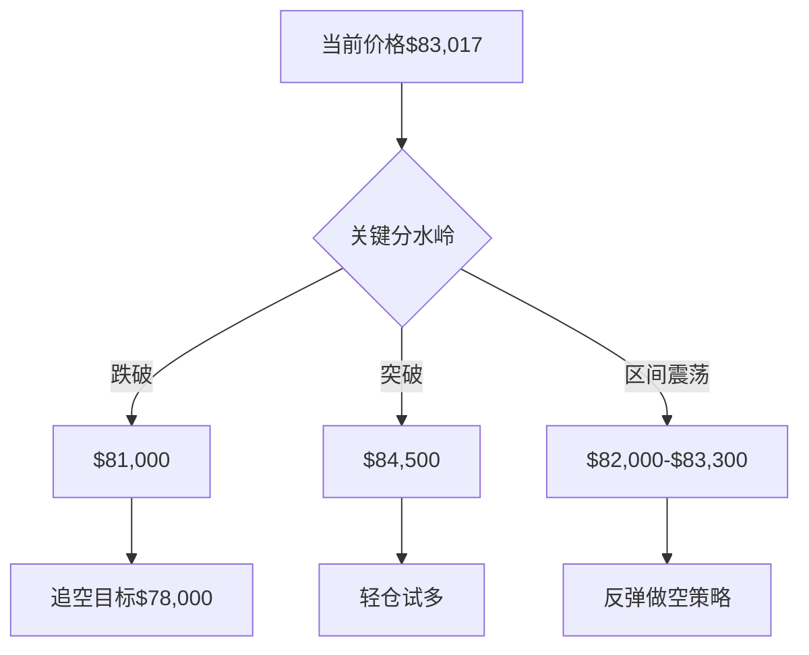

# 实时技术分析报告

## 📊 分析摘要
- 分析模型: deepseek-r1 (聚合分析)
- 最终建议: hold
- 置信度: 0

## 📈 详细分析
# BTCUSDT 综合技术分析报告

## 模型观点对比分析

### deepseek 模型核心观点
1. **趋势判断**：中期下跌趋势主导（强度35.23），日线进入超卖修复区间
2. **关键信号**：
   - 三周期RSI均超卖（日线18.88/4小时20.87）
   - MACD死叉延续但1小时动能减弱
   - 价格跌破所有周期布林带下轨
3. **操作建议**：观望或谨慎做空（≤5%仓位）
4. **风控重点**：警惕日线超卖修复反弹

### qwen 模型核心观点
1. **趋势判断**：中期下跌趋势明确，日线横盘偏弱
2. **关键信号**：
   - 日线/4小时RSI严重超卖存在反弹需求
   - 价格阶梯式下跌接近关键支撑
   - 1小时进入震荡区间（$82,000-$83,300）
3. **操作建议**：等待反弹至$83,800-$84,300区间做空
4. **风控重点**：防范超卖暴力反弹

---

## 模型异同点对比

| 分析维度       | deepseek                                | qwen                                      | 一致性评估 |
|----------------|-----------------------------------------|-------------------------------------------|------------|
| **趋势判断**   | 中期下跌主导，日线转向震荡              | 中期明确下跌，日线横盘偏弱                | 高度一致   |
| **关键支撑**   | $82,935(4h下轨)/$81,118(前低)           | $82,935(4h下轨)/$81,118(前低)             | 完全一致   |
| **关键阻力**   | $83,300(1h前高)/$84,500(日线中轨)       | $83,300(1h前高)/$84,735(近期高点)         | 基本一致   |
| **RSI解读**    | 超卖预示反弹需求                        | 严重超卖需价格行为配合                    | 一致       |
| **操作策略**   | 保守观望+破位做空                       | 主动捕捉反弹做空机会                      | 策略差异   |
| **仓位管理**   | ≤5%                                     | ≤10%                                      | 差异       |
| **止损设置**   | $84,500(日线中轨)                       | $84,800(近期高点上方)                     | 相近       |

---

## 综合趋势判断

1. **多周期共振**：
   - 日线：极端超卖（RSI18.88）+价格破布林下轨
   - 4小时：下跌趋势明确（强度35.23）+ MACD死叉加速
   - 1小时：区间震荡待突破（$82,000-$83,300）

2. **核心矛盾**：
   - **技术面**：中期下跌趋势 vs 日线超卖反弹需求
   - **动能结构**：MACD空头主导但1小时动能衰减

3. **关键验证位**：
   - **下跌延续**：日线收盘＜$81,000
   - **趋势反转**：4小时收盘＞$84,500
   - **短期方向**：1小时突破$83,300或跌破$82,000

---

## 交易建议

### 决策框架


### 具体操作
1. **首选策略**：反弹做空
   - **入场区间**：$83,800-$84,300（结合两模型共识区间）
   - **触发条件**：
     - 1小时图出现滞涨K线（长上影/吞没阴线）
     - 4小时RSI回升至40后拐头向下
   - **仓位**：3%-5%（保守仓位应对趋势矛盾）

2. **次选策略**：破位追空
   - **触发条件**：1小时收盘＜$81,000
   - **入场点**：$80,800-$81,000
   - **目标位**：$78,000（日线支撑延伸）

3. **逆势策略**：超跌反弹
   - **触发条件**：日线收盘＞$84,500 + MACD转正
   - **入场点**：$84,500-$85,000
   - **目标位**：$87,500（4小时MA20）

### 风控参数
| 策略类型 | 止损位       | 止盈目标              | 盈亏比  |
|----------|--------------|-----------------------|---------|
| 反弹做空 | $84,800      | $81,100→$78,000       | 1:3.5   |
| 破位追空 | $82,000      | $78,000               | 1:4     |
| 超跌反弹 | $83,500      | $87,500               | 1:3     |

---

## 风险收益分析

### 风险预警
1. **极端波动风险**：
   - 4小时波动区间达$9,216，单日波动可能超$3,000
   - 建议止损空间≥$1,500（1.8%）

2. **流动性风险**：
   - 未提供未平仓合约数据，警惕薄价差环境
   - 关键位操作需使用限价单+滑点预留0.2%

3. **事件驱动风险**：
   - 美联储议息（2026年2月）可能引发剧烈波动
   - 比特币ETF资金流数据未纳入分析

### 收益预期
| 场景         | 概率  | 潜在空间 | 仓位建议 |
|--------------|-------|----------|----------|
| 下跌延续     | 55%   | -6.0%    | 5%       |
| 超卖反弹     | 35%   | +5.4%    | 3%       |
| 区间震荡     | 10%   | ±1.5%    | 0%       |

---

## 结论建议

**当前最佳策略**：  
✅ **在$83,800-$84,300区间建立空头头寸**  
- 止损：$84,800（近期高点上方1.0%）  
- 目标：$81,100（第一目标）/ $78,000（第二目标）  
- 仓位：≤5%总资产  

**辅助策略**：  
⚠️ **价格跌破$81,000后追空**  
- 止损：$82,000  
- 目标：$78,000  
- 仓位：≤3%  

**严格回避**：  
❌ 当前价位（$83,017）直接抄底  
❌ 未突破$84,500前做多  

> **操作备注**：所有策略需在关键位触发后执行，避免提前入场。建议使用OCO订单（One Cancels Other）管理多目标止盈。

## 💡 交易建议
- 操作: hold
- 置信度: 0
- 分析理由: 无详细理由

## 🤖 模型详细结果
### deepseek
- 分析: ```markdown
# BTCUSDT 技术分析报告  
**分析时间**：2026-01-30 07:13:27 UTC  
**当前价格**：$83,017.77 (-6.00% 24h)  

---

## 📊 多时间框架趋势分析
### 日线图（长期趋势）
- **趋势方向**：横向震荡（`sideways`），强度为0，无明确方向。  
- **关键结构**：  
  - **阻力**：日线布林带上轨（$98,341）、MA20（$90,739）。  
  - **支撑**：布林带下轨（$83,137）已被跌破，下一支撑为$78,000（前低延伸）。  
- **信号**：RSI超卖（18.88），MACD柱状线负值扩大（-882），显示长期下跌动能延续。  

### 4小时图（中期趋势）
- **趋势方向**：下跌（`down`），强度35.23（中等偏弱）。  
- **关键结构**：  
  - **阻力**：MA20（$87,543）、布林带中轨（$87,543）。  
  - **支撑**：布林带下轨（$82,935）。  
- **信号**：RSI超卖（20.87），MACD死叉且柱状线负值扩大（-654），中期看跌。  

### 1小时图（短期趋势）
- **趋势方向**：下跌（`down`），强度40.06。  
- **关键结构**：  
  - **阻力**：短期高点$83,300（1小时前高）。  
  - **支撑**：$82,000（近期低点）。  
- **信号**：RSI中性（39.58），MACD死叉但柱状线轻微收窄（-6.07），短期可能反弹。  

### 趋势一致性分析
- **共振**：日线/4小时/1小时均处于下跌趋势，但日线转为震荡，需警惕方向切换。  
- **背离**：日线RSI超卖 vs. 价格新低，潜在看涨背离酝酿中。  

### 主导趋势判断
- **结论**：中期下跌趋势主导，日线进入超卖修复区间。  

---

## 🎯 关键价格位
| 类型       | 价格位              | 依据                     |
|------------|---------------------|--------------------------|
| **支撑位** | $82,935            | 4小时布林带下轨         |
|            | $81,118            | 4小时前低点             |
| **阻力位** | $83,300            | 1小时近期高点          |
|            | $84,304            | 1小时布林带中轨        |
| **突破位** | ↗️ $84,500（日线中轨） | 趋势反转信号            |
|            | ↘️ $81,000         | 加速下跌确认位         |

---

## 📈 技术信号解读
### RSI分析
- **日线**：超卖（18.88），存在反弹需求。  
- **4小时**：超卖（20.87），与价格背离可能。  
- **1小时**：中性（39.58），无明确方向。  

### MACD分析
- **日线**：死叉延续，柱状线扩大（-882），看跌动能强。  
- **4小时**：死叉加速（Histogram -654），看跌主导。  
- **1小时**：死叉但柱状线收窄（-6.07），短期动能减弱。  

### 均线系统
- **排列形态**：价格低于所有均线（MA20/MA50），空头排列。  
- **关键阻力**：1小时MA20（$84,304）、4小时MA20（$87,543）。  

### 布林带分析
- **日线**：价格跌破下轨（$83,137），极端超卖。  
- **4小时**：价格贴近下轨（$82,935），弱势区间。  
- **1小时**：价格位于中轨（$84,304）下方，偏空。  

---

## 🔍 图表形态识别
- **日线**：下降趋势延续，未形成经典反转形态。  
- **4小时**：阶梯式下跌，近期出现长下影线（$81,118），潜在止跌信号。  
- **1小时**：区间震荡（$82,000–$83,300），等待方向突破。  
- **形态置信度**：中低，需量能配合确认。  

---

## 💡 交易建议
### 推荐操作
**观望或谨慎做空**（需满足共振信号）。  

### 入场条件
- **做空**：1小时收盘价跌破$82,000 + 4小时RSI脱离超卖区。  
- **做多**：日线收盘价突破$84,500 + MACD柱状线转正。  

### 入场区间
- 做空：$83,000–$83,300  
- 做多：$82,000–$82,500（左侧风险高）  

### 止损位
- 做空：$84,500（日线布林带中轨上方）  
- 做多：$80,800（前低下方）  

### 止盈目标
1. **短期**：$81,000（1小时前低）  
2. **中期**：$78,000（日线支撑延伸）  

### 仓位建议
- **最大仓位**：≤5%（因趋势未完全共振）  
- **佣金影响**：单向成本0.1%，需在止盈目标中预留空间。  

---

## ⚠️ 风险提示
1. **时间框架冲突**：日线超卖可能引发反弹，与4小时下跌冲突，建议等待日线RSI回升至30以上再行动。  
2. **波动性评估**：4小时振幅超$3,000，市场情绪脆弱。  
3. **主要风险**：  
   - 交易所流动性不足（未提供未平仓合约数据）。  
   - 超卖修复反弹强于预期。  
4. **分析失效条件**：  
   - 价格突破$84,500并站稳。  
   - 日线RSI快速回升至50以上。  

```

```json
{
  "trend_analysis": {
    "daily": {
      "direction": "sideways",
      "strength": 0,
      "support": ["83137 (布林带下轨)", "78000 (延伸支撑)"],
      "resistance": ["90739 (MA20)", "98341 (布林带上轨)"]
    },
    "4h": {
      "direction": "down",
      "strength": 35.23,
      "support": ["82935 (布林带下轨)", "81118 (前低)"],
      "resistance": ["87543 (MA20)"]
    },
    "1h": {
      "direction": "down",
      "strength": 40.06,
      "support": ["82000", "81118"],
      "resistance": ["83300", "84304 (MA20)"]
    },
    "consistency": "下跌共振但日线转向震荡",
    "dominant_trend": "中期下跌"
  },
  "key_levels": {
    "primary_support": ["82935", "81118"],
    "primary_resistance": ["83300", "84304"],
    "breakout_levels": ["84500 (反转信号)", "81000 (下跌加速)"]
  },
  "technical_signals": {
    "RSI": {
      "daily": "超卖(18.88)",
      "4h": "超卖(20.87)",
      "1h": "中性(39.58)"
    },
    "MACD": {
      "daily": "死叉动能增强(-882)",
      "4h": "死叉延续(-654)",
      "1h": "死叉收窄(-6.07)"
    },
    "moving_averages": "空头排列（价格低于所有均线）",
    "bollinger_bands": "各周期均位于中轨下方"
  },
  "trading_recommendation": {
    "action": "观望/谨慎做空",
    "entry_conditions": {
      "short": "1h收盘<82000 + 4h RSI>30",
      "long": "日线收盘>84500 + MACD转正"
    },
    "entry_range": ["82000-82500 (多)", "83000-83300 (空)"],
    "stop_loss": ["80800 (多)", "84500 (空)"],
    "take_profit": ["81000 (短)", "78000 (中)"],
    "position_size": "≤5%"
  },
  "risk_warnings": [
    "日线超卖修复可能引发反弹",
    "未平仓合约数据缺失影响流动性评估",
    "失效条件：价格突破84500"
  ]
}
```
- 分析时间: 2026-01-30 15:14:36
- 响应时间: 69.17000000秒

### qwen
- 分析: # 📊 BTCUSDT 多时间框架技术分析报告  
**分析时间（UTC）：2026-01-30 07:13:27**  
**当前价格：$83,017.77**

---

## 📊 多时间框架趋势分析

### **日线图（长期趋势）**
- **趋势方向**：横盘（sideways），强度为 0。
- **解读**：日线图未显示明确趋势，但最近两根K线连续收阴，且价格已跌破关键支撑区域（如MA20 = $90,739.32 和布林带下轨 = $83,137.08）。当前价格 $83,017.77 略低于布林带下轨，表明短期超卖压力显著。
- **长期支撑/阻力**：
  - 支撑：$83,137（布林带下轨）、$81,118（近期低点）
  - 阻力：$84,735（前高）、$89,300（前期高点）

### **4小时图（中期趋势）**
- **趋势方向**：下行（down），强度为 35.23。
- **解读**：4小时图呈现明确的下跌趋势，价格持续运行于MA20（$87,543.72）和MA50（$88,373.05）下方。最近一根K线虽小幅反弹，但整体仍处于空头主导格局。
- **中期支撑/阻力**：
  - 支撑：$82,935.72（布林带下轨）、$81,118（前低）
  - 阻力：$84,735（近期高点）、$87,543（MA20）

### **1小时图（短期趋势）**
- **趋势方向**：下行（down），强度为 40.06。
- **解读**：1小时图延续下跌动能，但最近一根K线收阳，显示短期有企稳迹象。价格目前位于布林带中轨（$84,304.10）与下轨（$80,831.75）之间，接近下轨区域。
- **短期支撑/阻力**：
  - 支撑：$82,056（近期低点）、$80,831（布林带下轨）
  - 阻力：$83,100（近期高点）、$83,332（前高）

### **趋势一致性分析**
- **日线图**：横盘偏弱，但无明确方向；
- **4小时图 & 1小时图**：均显示下行趋势；
- **结论**：**中期与短期趋势一致看跌**，但日线图缺乏明确方向，形成“**中期主导、短期跟随、长期观望**”的结构。**无明显背离**。

### **主导趋势判断**
- **以4小时图为主导**，1小时图用于寻找反弹做空或超跌反弹机会；
- 日线图虽横盘，但价格已跌破布林带下轨，**倾向于看空**，除非快速收复 $84,735。

---

## 🎯 关键价格位（多时间框架综合）

| 类型 | 价格（USDT） | 依据 |
|------|---------------|------|
| **主要支撑位** | $82,935.72 | 4小时布林带下轨 |
| | $81,118.00 | 近期4小时/日线低点 |
| **主要阻力位** | $84,735.75 | 近期高点（4小时/日线） |
| | $87,543.72 | 4小时MA20 |
| **短期支撑/阻力** | $82,056.08 | 1小时近期低点 |
| | $83,100.00 | 1小时近期高点 |
| **关键突破位** | $83,137.08 | 日线布林带下轨（心理关口） |
| | $84,304.10 | 1小时MA20（短期均线压制） |

---

## 📈 技术信号解读（多时间框架对比）

### **RSI分析**
- **日线 RSI = 18.88** → **严重超卖**，历史上该水平常伴随短期反弹；
- **4小时 RSI = 20.87** → **超卖**，但尚未出现底背离；
- **1小时 RSI = 39.58** → **中性偏弱**，略高于30，显示短期抛压缓解；
- **结论**：**日线与4小时严重超卖，存在反弹需求，但需确认价格行为配合**。

### **MACD分析**
- **日线 MACD = -1422.22，Signal = -540.17，Histogram = -882.05** → **死叉后持续扩大负值，空头动能强**；
- **4小时 MACD = -1289.90，Signal = -635.59，Histogram = -654.31** → **死叉，动能加速下行**；
- **1小时 MACD = -1316.99，Signal = -1310.91，Histogram = -6.08** → **死叉但动能趋缓，接近零轴**；
- **结论**：**日线与4小时空头占优，1小时动能减弱，短期或有反弹**。

### **均线系统**
- 所有时间框架价格均**低于MA20与MA50**（除日线MA50缺失）；
- **均线呈空头排列**（4小时：MA20 < MA50；1小时：MA20 < MA50）；
- **价格远离均线**，存在回归需求，但方向取决于反弹力度。

### **布林带分析**
- **日线**：价格跌破下轨（$83,137），极端波动，通常伴随反转；
- **4小时**：价格贴近下轨（$82,935），接近超卖区域；
- **1小时**：价格位于中轨与下轨之间，布林带收口，波动率下降；
- **结论**：**布林带下轨构成强支撑，若跌破则打开下行空间；若反弹，则可能测试中轨**。

---

## 🔍 图表形态识别

### **日线图形态**
- 最近5根K线：**三连阳后两连阴**，形成“**上涨受阻 + 快速回落**”结构；
- 无明确经典形态（如头肩顶、双顶等），但**高点下移、低点下破**，隐含**潜在下降通道**；
- **置信度：中低**，需更多K线确认。

### **4小时图形态**
- 从 $89,300 高点回落，形成**阶梯式下跌**；
- 最近一根阳线未能收复前阴线50%回撤，**弱势反弹**；
- **疑似下降旗形整理末端**，若跌破 $81,118 则确认；
- **置信度：中**。

### **1小时图形态**
- 近期在 $82,000–$83,300 区间震荡，形成**小级别箱体**；
- 无明显突破方向，**观望形态**；
- **置信度：低**。

### **形态确认**
- **缺乏量能数据**，无法确认形态有效性；
- **建议结合价格突破关键位后再行动**。

---

## 💡 交易建议（基于多时间框架共振）

### **推荐操作**：**观望 + 准备反弹做空机会**  
> 虽然日线与4小时严重超卖，但趋势仍偏空，**不建议盲目抄底**。等待1小时图出现明确反弹信号后，结合4小时阻力位做空。

### **入场条件**
- 1小时图：价格反弹至 $83,300–$84,300 区间，且出现**滞涨K线**（如长上影、吞没阴线）；
- 4小时图：RSI 从超卖区回升至 40 以上后再次拐头向下；
- MACD 在1小时图出现**二次死叉**。

### **入场区间**
- **做空区间**：$83,800 – $84,300

### **止损位**
- **做空止损**：$84,800（略高于近期高点 $84,735）

### **止盈目标**
- **第一目标（短期）**：$82,000（1小时支撑 + 4小时布林下轨）
- **第二目标（中期）**：$81,100（前低）

### **仓位建议**
- 当前信号**中等强度**（超卖但趋势未反转）；
- 建议仓位：**≤ 10% 总资产**（即 ≤ $7.09）；
- 若价格跌破 $81,118，可考虑加仓做空，但需重新评估。

> **佣金成本影响**：买卖双边 0.1%，对短线交易影响显著，**建议仅在高概率、高盈亏比场景下交易**。

---

## ⚠️ 风险提示

### **时间框架冲突**
- 日线横盘 vs 4小时/1小时下跌 → **以4小时为主导**，但需警惕日线突然反转；
- **处理方式**：若日线收复 $84,735 并站稳，立即停止做空思路。

### **当前市场波动性评估**
- 日线布林带宽度 ≈ $15,204，4小时 ≈ $9,216，1小时 ≈ $6,945；
- **波动率处于高位**，单日波动超 $3,000 常见，**止损需宽松**。

### **需警惕的主要风险**
1. **超卖反弹**：RSI 极端低位可能引发暴力反弹；
2. **流动性不足**：未提供成交量与OI，无法确认支撑/阻力有效性；
3. **外部事件**：宏观政策、监管消息可能瞬间逆转走势。

### **分析失效条件**
- **价格收盘站上 $84,735（4小时/日线阻力）** → 空头逻辑失效；
- **日线 RSI 快速回升至 50 以上** → 趋势转多；
- **1小时图放量突破 $83,332 并站稳 MA20** → 短期转强。

---

## ✅ 结论
> **当前市场处于“超卖但趋势未反转”状态**。  
> **不建议抄底，但可准备在 $83,800–$84,300 区间做空，止损 $84,800，目标 $82,000 / $81,100**。  
> **若价格跌破 $81,118，下行空间打开；若收复 $84,735，则转为观望或轻仓试多**。

---

```json
{
  "analysis_time_utc": "2026-01-30T07:13:27Z",
  "symbol": "BTCUSDT",
  "current_price": 83017.77,
  "trend_analysis": {
    "daily": {
      "direction": "sideways",
      "strength": 0,
      "support": [83137.08, 81118.0],
      "resistance": [84735.75, 89300.0]
    },
    "four_hour": {
      "direction": "down",
      "strength": 35.23415186,
      "support": [82935.72, 81118.0],
      "resistance": [84735.75, 87543.72]
    },
    "one_hour": {
      "direction": "down",
      "strength": 40.05838111,
      "support": [82056.08, 80831.75],
      "resistance": [83100.0, 83332.2]
    },
    "consensus": "中期与短期看跌，长期横盘；无显著背离"
  },
  "key_levels": {
    "major_support": [82935.72, 81118.0],
    "major_resistance": [84735.75, 87543.72],
    "short_term_support": [82056.08, 80831.75],
    "short_term_resistance": [83100.0, 83332.2],
    "breakout_levels": [83137.08, 84304.1]
  },
  "technical_signals": {
    "rsi": {
      "daily": {"value": 18.88121889, "status": "oversold"},
      "four_hour": {"value": 20.8670564, "status": "oversold"},
      "one_hour": {"value": 39.57896642, "status": "neutral"}
    },
    "macd": {
      "daily": {"macd": -1422.22226368, "signal": -540.17270652, "histogram": -882.04955715, "interpretation": "bearish momentum"},
      "four_hour": {"macd": -1289.89534062, "signal": -635.58764889, "histogram": -654.30769174, "interpretation": "bearish momentum accelerating"},
      "one_hour": {"macd": -1316.99300198, "signal": -1310.91462744, "histogram": -6.07837454, "interpretation": "bearish but slowing"}
    },
    "moving_averages": {
      "alignment": "bearish across all timeframes",
      "price_vs_ma": "below MA20 and MA50 on 4h and 1h"
    },
    "bollinger_bands": {
      "daily": "price below lower band (extreme oversold)",
      "four_hour": "price near lower band",
      "one_hour": "price between middle and lower band, bands narrowing"
    }
  },
  "chart_patterns": {
    "daily": {"pattern": "potential descending channel", "confidence": "low"},
    "four_hour": {"pattern": "descending flag", "confidence": "medium"},
    "one_hour": {"pattern": "range-bound", "confidence": "low"}
  },
  "trading_recommendation": {
    "action": "watch for short opportunity on rally",
    "entry_conditions": "Price rallies to 83800-84300 with bearish reversal candle on 1h",
    "entry_zone": [83800, 84300],
    "stop_loss": 84800,
    "take_profit": [82000, 81100],
    "position_size_pct": 10
  },
  "risk_warnings": {
    "timeframe_conflict": "Daily sideways vs 4h/1h down — prioritize 4h trend",
    "volatility": "High (Bollinger width > $6k on 1h)",
    "key_risks": ["Oversold bounce", "Lack of volume/OI data", "External news"],
    "invalidation_conditions": [
      "Close above 84735.75 on 4h or daily",
      "Daily RSI > 50",
      "1h close above 83332 with volume"
    ]
  }
}
```
- 分析时间: 2026-01-30 15:14:56
- 响应时间: 88.62000000秒

## ⚠️ 风险分析
- 市场风险: 加密货币市场波动较大，请谨慎交易
- 模型风险: AI模型分析基于历史数据，可能无法预测突发市场事件
- 执行风险: 交易执行价格可能与分析时的价格存在差异

## 📝 交易策略建议
1. **资金管理**: 建议使用不超过总资金20%的资金进行单笔交易
2. **止损设置**: 建议设置5-10%的止损位，控制单笔交易风险
3. **止盈设置**: 建议设置15-30%的止盈位，确保收益
4. **仓位管理**: 根据市场波动性调整仓位大小
5. **监控频率**: 建议至少每4小时监控一次交易情况

## 📄 免责声明
本分析报告仅供参考，不构成任何投资建议。
交易决策请结合个人风险承受能力和市场实际情况。
过往表现不代表未来结果，投资有风险，入市需谨慎。