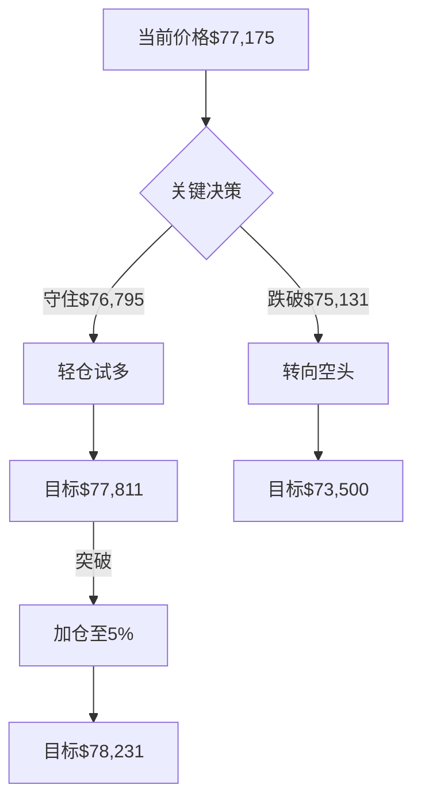

# 实时技术分析报告

## 📊 分析摘要
- 分析模型: deepseek-r1 (聚合分析)
- 最终建议: hold
- 置信度: 0

## 📈 详细分析
# 📊 BTCUSDT综合技术分析报告  
**更新日期**：2026-02-02 UTC  
**当前价格**：$77,175.13  

---

## 🔍 模型分析对比  
### deepseek核心观点  
1. **趋势结构**：日线震荡+4小时/1小时下跌形成「熊市震荡」  
2. **关键信号**：  
   - 三时间框架RSI同步超卖（日线17.06/4小时16.47）  
   - 1小时MACD柱状图转正（+92.79）  
3. **操作建议**：  
   - 轻仓参与反弹（≤5%仓位）  
   - 入场区间：$76,500 - $77,000  
   - 止损：$75,100（突破4小时下轨）  

### qwen核心观点  
1. **趋势矛盾**：日线横盘 vs 4小时强下跌（强度74.14）  
2. **关键信号**：  
   - 1小时形成下降楔形（看涨反转形态）  
   - MACD出现1小时金叉但4小时仍死叉  
3. **操作建议**：  
   - 主策略观望，次策略≤5%轻仓试多  
   - 入场需三重确认：  
     - 突破$77,555  
     - 1小时RSI>50  
     - 守住$75,131支撑  

---

## ⚖️ 模型异同对比  
| 分析维度       | deepseek                          | qwen                              | 一致性   |  
|----------------|-----------------------------------|-----------------------------------|----------|  
| **主导趋势**   | 中期下跌趋势主导                  | 4小时强下跌+日线横盘              | ★★★☆☆   |  
| **RSI解读**    | 超卖但未现背离                    | 极端超卖构成多头机会              | ★★★★☆   |  
| **MACD信号**   | 1小时动能修复                     | 1小时金叉 vs 高周期死叉           | ★★★★☆   |  
| **关键支撑**   | $76,795(日线)/$75,131(4小时)      | $76,795/$75,131                   | ★★★★★   |  
| **入场逻辑**   | 贴近支撑轻仓博反弹                | 突破确认后追多                    | ★★☆☆☆   |  
| **风险控制**   | 严格止损$75,100                   | 双止损策略($76,600/$76,400)       | ★★★☆☆   |  

**核心分歧点**：  
- deepseek主张支撑位主动布局，qwen要求突破确认后入场  
- 对MACD金叉的权重：deepseek视作反弹信号，qwen强调需配合RSI>50  

---

## 📈 综合分析结论  
### 市场状态判断  
1. **中期趋势**：4小时周期明确下跌趋势（强度>74），均线空头排列压制明显  
2. **短期机会**：  
   - 三周期RSI同步超卖（日线/4小时<20）  
   - 1小时MACD金叉+潜在底部形态（孕线/下降楔形）  
3. **关键矛盾**：  
   - 超卖修复需求 vs 中期下行惯性  
   - 量能信号缺失增加判断难度  

### 多空平衡点  
- **多头防线**：$76,795（日线布林下轨）+$75,131（4小时下轨）  
- **空头防线**：$77,811（1小时MA20）+$78,231（近期高点）  

---

## 💡 综合交易建议  
### 操作决策  
**轻仓参与技术性反弹（仓位≤5%）**，同时准备两种应对方案：  

### 具体执行策略  
| 策略类型       | 适用场景                          | 操作要点                          |  
|----------------|-----------------------------------|-----------------------------------|  
| **主动布局型** | 价格回踩$76,500-$76,800           | 1. 仓位3%<br>2. 止损$75,080<br>3. 初始目标$77,811 |  
| **突破追进型** | 1小时收盘>77,811且RSI>50          | 1. 加仓2%<br>2. 止损上移至$76,800<br>3. 目标$78,231 |  
| **观望条件**   | 价格<76,463或>79,200              | 暂停操作等待新信号                |  

### 目标与风控  
- **止盈阶梯**：  
  ```mermaid
  graph LR
  A[第一目标 $77,811] --> B[第二目标 $78,231]
  B --> C[乐观目标 $79,160]
  ```
- **动态止损**：  
  - 初始止损：$75,080（突破4小时下轨）  
  - 突破$77,811后：上移至$76,800（1小时前低）  
  - 触及$78,231后：上移至$77,500（盈亏平衡）  

### 仓位管理  
- **最大风险敞口**：0.5%总资产（按止损$1,500计算）  
- **盈亏比配置**：  
  - 基础比例 1:2.5（$76,800→$78,231）  
  - 突破延伸 1:4（$77,000→$79,160）  

---

## ⚠️ 综合风险评估  
### 潜在收益空间  
- **保守**：$77,800 → **+1.5%**（扣除手续费）  
- **乐观**：$79,160 → **+4.2%**  

### 主要风险维度  
| 风险类型       | 概率   | 影响   | 应对措施                    |  
|----------------|--------|--------|-----------------------------|  
| 趋势延续       | 中高   | 高     | 严格止损$75,080             |  
| 假突破        | 中     | 中     | 突破$77,811需放量确认       |  
| 波动加剧       | 高     | 中     | 仓位≤5%+分段止盈            |  
| 流动性陷阱    | 低     | 极高   | 避免$75,000下方挂单          |  

### 关键失效信号  
- **多头失效**：日线收盘<76,795或4小时实体阴线破75,131  
- **空头失效**：1小时连续三根阳线突破78,231  

---

## ✅ 最终结论  
当前BTCUSDT处于**技术性反弹与趋势延续的博弈节点**。中期下跌趋势未改，但三周期超卖+短期动能反转构成反弹基础。建议：  
1. **主策略**：5%仓位分两阶段参与反弹  
2. **核心风控**：初始止损$75,080不可动摇  
3. **关键观察点**：  
   - $77,811突破有效性（需1小时收盘+RSI>50）  
   - $75,131支撑强度（4小时收盘能否守稳）  

> ＂在下跌趋势中博反弹，如同暴雨中拾伞——既要敏捷又要知止＂（交易谚语）  



## 💡 交易建议
- 操作: hold
- 置信度: 0
- 分析理由: 无详细理由

## 🤖 模型详细结果
### deepseek
- 分析: ```json
{
  "analysis_summary": {
    "trend_consistency": "日线震荡/4小时下跌/1小时下跌",
    "dominant_trend": "中期下跌趋势",
    "key_support_levels": ["76795.38 (日线下轨)", "75131.18 (4小时下轨)"],
    "key_resistance_levels": ["88559.16 (日线MA20)", "80896.25 (4小时MA20)"],
    "operation_recommendation": "轻仓反弹策略",
    "risk_rating": "中等"
  }
}
```

# 📊 BTCUSDT多时间框架技术分析报告  
**更新时间**：2026-02-02 02:28:30 UTC  
**当前价格**：$77,175.13 (-1.84% 24h)  

---

## 📊 多时间框架趋势分析
### 日线图（长期趋势）
- **趋势方向**：震荡（sideways）  
- **强度**：0（无明确方向性）  
- **关键结构**：  
  - **支撑**：布林带下轨 $76,795.38  
  - **阻力**：MA20均线 $88,559.16  
- **特征**：连续4根阴线后出现小阳线，RSI(17.06)严重超卖  

### 4小时图（中期趋势）
- **趋势方向**：下跌（down）  
- **强度**：74.13（较强）  
- **关键结构**：  
  - **支撑**：布林带下轨 $75,131.18  
  - **阻力**：MA20均线 $80,896.25  
- **特征**：RSI(16.47)极端超卖，MACD柱状图持续负值  

### 1小时图（短期趋势）
- **趋势方向**：下跌（down）  
- **强度**：27.51（较弱）  
- **关键结构**：  
  - **支撑**：布林带下轨 $76,463.60  
  - **阻力**：MA20均线 $77,811.87  
- **特征**：MACD柱状图转正（+92.79），暗示短期动能修复  

### 趋势一致性分析
- **共振现象**：日线震荡+4小时/1小时下跌形成「熊市震荡」结构  
- **背离信号**：日线/4小时RSI超卖 vs 价格持续下行（潜在底背离雏形）  

### 主导趋势判断
中期下跌趋势主导（4小时图），日线超卖提供反弹背景，1小时图MACD转正暗示短期修复可能  

---

## 🎯 关键价格位（多时间框架综合）
### 主要支撑位
1. $76,795（日线布林带下轨）  
2. $75,131（4小时布林带下轨）  

### 主要阻力位
1. $80,896（4小时MA20）  
2. $88,559（日线MA20）  

### 短期关键位
- **支撑**：$76,463（1小时布林带下轨）  
- **阻力**：$77,811（1小时MA20）  

### 关键突破位
- **上破确认**：$77,811（1小时MA20）+ $78,000（心理关口）  
- **下破警报**：$75,131（4小时下轨破位将加速下行）  

---

## 📈 技术信号解读
### RSI多框架对比
- **日线**：17.06（超卖）→ 极端超卖但未现背离  
- **4小时**：16.47（超卖）→ 历史罕见超卖区域  
- **1小时**：37.62（中性）→ 修复空间充足  
- **背离提示**：若价格新低而RSI未创新低，将形成底背离  

### MACD动能分析
- **日线**：柱状图-1446.21 → 强下跌动能  
- **4小时**：柱状图-271.37 → 下跌动能减弱  
- **1小时**：柱状图+92.79 → 短期动能反转  
- **交叉预警**：1小时MACD若上穿信号线将形成金叉  

### 均线系统
- **日线**：价格远低于MA20（$88,559），空头排列  
- **4小时**：价格被MA20（$80,896）和MA50（$85,252）压制  
- **1小时**：MA20（$77,811）为近期强弱分水岭  

### 布林带状态
- **日线**：价格触及下轨（$76,795），通道扩张  
- **4小时**：价格贴下轨（$75,131）运行，超卖延续  
- **1小时**：价格脱离下轨（$76,463），向中轨反弹  

---

## 🔍 图表形态识别
### 日线图形态
- **潜在下降通道**：连续高点下移（84,270→79,424）  
- **形态置信度**：中（需突破$80,896确认反转）  

### 4小时图形态
- **下跌旗形雏形**：急跌后横盘整理（$75,131-$78,000区间）  
- **量能配合**：无成交量数据，形态待确认  

### 1小时图形态
- **孕线结构**：最新K线高低点包含在前一根K线范围内  
- **反转信号**：若突破$77,811将确认短期底部  

---

## 💡 交易建议
### 推荐操作
**轻仓参与反弹**（风险偏好型）/ **观望**（保守型）  

### 入场条件
需同时满足：  
1. 1小时收盘价 > $77,811（MA20突破）  
2. MACD柱状图持续扩大  

### 入场区间
$76,500 - $77,000（贴近1小时下轨）  

### 止损位
$75,100（4小时布林带下轨下方）  

### 止盈目标
1. **短期**：$78,000（1小时前高+心理位）  
2. **中期**：$80,896（4小时MA20）  

### 仓位建议
**≤5%**（因日线未确认反转，4小时仍处下行趋势）  

---

## ⚠️ 风险提示
### 时间框架冲突
- **矛盾点**：日线超卖vs中期下行趋势  
- **应对**：仅轻仓参与反弹，突破$80,896前不追多  

### 波动性评估
- **潜在波动区间**：$75,131 - $80,896（4小时布林带宽11,530点）  
- **单日波动阈值**：当前1小时振幅达$1,583，警惕插针风险  

### 主要风险
1. **流动性缺口**：$75,000下方缺乏历史支撑数据  
2. **指标失效**：极端超卖环境下RSI可能持续钝化  
3. **费率成本**：单笔交易成本约0.2%（含taker fee）  

### 分析失效条件
- **多头失效**：日线收盘 < $76,795  
- **空头失效**：4小时收盘 > $80,896  

---

> **免责声明**：本分析基于历史数据，不构成投资建议。实际交易请结合实时行情与个人风险承受能力，严格设置止损。
- 分析时间: 2026-02-02 10:29:32
- 响应时间: 62.56000000秒

### qwen
- 分析: # 📊 BTCUSDT 多时间框架技术分析报告  
**分析时间（UTC）：2026-02-02 02:28:30**  
**当前价格：$77,175.13**

---

## 📊 多时间框架趋势分析

### **日线图（长期趋势）**
- **趋势方向**：横盘（sideways），强度为 0。
- **解读**：尽管近期连续收出多根阴线，但趋势指标未显示明确方向。价格处于布林带下轨（$76,795.38）附近，接近长期支撑区域。
- **关键观察**：MA20（$88,559.16）远高于当前价格，表明中长期仍处于下跌通道后的整理阶段。

### **4小时图（中期趋势）**
- **趋势方向**：下行（down），强度高达 **74.14**，属强趋势。
- **解读**：价格持续运行于 MA20（$80,896.25）和 MA50（$85,252.45）下方，均线呈空头排列，中期看跌结构清晰。
- **支撑/阻力**：布林带下轨 $75,131.18 为关键中期支撑；上轨 $86,661.33 为强阻力。

### **1小时图（短期趋势）**
- **趋势方向**：下行（down），强度 **27.51**，属弱至中等下跌动能。
- **解读**：价格在布林带中轨（$77,811.87）与下轨（$76,463.60）之间震荡，短期偏弱但未加速下跌。
- **即时动态**：最近两根K线连续收阴，但跌幅收窄，出现小幅企稳迹象。

### **趋势一致性分析**
- **日线 vs 4小时**：日线“横盘”与4小时“强下跌”存在**轻微背离**——日线未确认趋势方向，但4小时主导中期下行。
- **1小时 vs 4小时**：两者方向一致（均为下行），但1小时动能较弱，可能酝酿短期反弹。
- **结论**：**中期主导趋势为下跌**，短期或有技术性反弹，但需等待更高时间框架信号确认反转。

### **主导趋势判断**
- **以4小时图为主导**（强下跌趋势），日线图处于超卖整理状态，1小时图用于捕捉反弹或延续下跌的入场点。
- **当前市场处于“下跌中继”或“超卖反弹”临界区**，需谨慎对待多头信号。

---

## 🎯 关键价格位（多时间框架综合）

| 类型 | 价格（USDT） | 依据 |
|------|---------------|------|
| **主要支撑位 1** | **$76,795.38** | 日线布林带下轨 + 近期低点区域 |
| **主要支撑位 2** | **$75,131.18** | 4小时布林带下轨 + 心理整数关口前低 |
| **主要阻力位 1** | **$77,811.87** | 1小时 MA20 + 布林带中轨 |
| **主要阻力位 2** | **$78,231.26** | 近期1小时高点（多次测试未破） |
| **短期支撑** | **$76,972.24** | 最近1小时K线低点 |
| **短期阻力** | **$77,555.62** | 最近1小时K线高点 |
| **关键突破位（多头）** | **> $78,231.26** | 突破近期高点 + 收复1小时MA20 |
| **关键突破位（空头）** | **< $76,463.60** | 跌破1小时布林带下轨，打开下行空间 |

---

## 📈 技术信号解读（多时间框架对比）

### **RSI分析**
| 时间框架 | RSI值 | 状态 | 解读 |
|----------|--------|------|------|
| **日线** | 17.06 | **严重超卖** | 长期抛压过度，存在反弹需求，但未出现底背离 |
| **4小时** | 16.47 | **极端超卖** | 中期超卖程度更深，历史上常伴随快速反弹 |
| **1小时** | 37.62 | **中性偏弱** | 脱离超卖区，但未进入强势区域 |

> ✅ **共振信号**：日线与4小时同时处于**极端超卖**，构成潜在多头机会，但需价格确认。

### **MACD分析**
| 时间框架 | MACD | Signal | Histogram | 动能趋势 |
|----------|------|--------|-----------|--------|
| **日线** | -3318.54 | -1872.32 | -1446.21 | **死叉扩大，空头动能强** |
| **4小时** | -2509.07 | -2237.70 | -271.37 | **死叉，但Histogram负值收窄？**（需更多数据） |
| **1小时** | -649.49 | -742.28 | **+92.80** | **金叉初现！Histogram转正，短期多头动能回升** |

> 🔍 **关键发现**：1小时MACD出现**金叉+柱状图翻红**，而4小时/日线仍为死叉。这是典型的**短期反弹信号**，但中期趋势未反转。

### **均线系统**
- **日线**：价格远低于MA20（$88,559），无均线支撑。
- **4小时**：价格受压于MA20（$80,896）和MA50（$85,252），空头排列。
- **1小时**：价格低于MA20（$77,811）和MA50（$79,674），但差距缩小，若站上MA20可视为短期转强。

### **布林带分析**
- **日线**：价格触及下轨（$76,795），通常伴随均值回归。
- **4小时**：价格贴近下轨（$75,131），带宽收窄，预示波动率压缩后可能爆发。
- **1小时**：价格在中轨与下轨之间，带宽稳定，无明显收缩或扩张。

---

## 🔍 图表形态识别

### **日线图形态**
- 近5日呈现**连续大阴线后小阳线**，类似“下跌抵抗”或“止跌十字星”雏形，但**未形成明确底部形态**（如双底、头肩底）。
- **置信度低**，缺乏量能配合（成交量数据缺失）。

### **4小时图形态**
- 形成**下降通道**：高点下移（$89,300 → $84,260 → $78,743 → $77,174），低点下移（$83,383 → $75,700 → $76,606）。
- 当前价格接近通道下轨，若跌破则加速下行，若反弹则可能测试通道上轨。

### **1小时图形态**
- 最近6根K线形成**小型下降楔形**（lower highs & lower lows，但斜率收敛），通常为**看涨反转形态**。
- **形态置信度中等**，需放量突破上沿（$77,555）确认。

> ⚠️ **形态总结**：短期存在反弹形态，但中期仍处下跌通道，**不可盲目抄底**。

---

## 💡 交易建议（基于多时间框架共振）

### **推荐操作**：**观望为主，激进者可轻仓试多（反弹策略）**

> **理由**：4小时/日线超卖 + 1小时MACD金叉 + 价格接近强支撑，但中期趋势未反转，风险收益比需严格控制。

### **入场条件**
- **必须同时满足**：
  1. 1小时图价格站上 **$77,555.62**（近期高点）
  2. 1小时RSI > 50（确认动能转强）
  3. 4小时图未跌破 **$75,131.18**

### **入场区间**
- **理想多单区间**：**$76,900 – $77,200**（当前价格附近，支撑区轻仓介入）
- **确认突破入场**：**>$77,555**（追多，风险较高）

### **止损位**
- **保守止损**：**$76,400**（略低于1小时布林带下轨）
- **激进止损**：**$76,600**（近期低点下方）

### **止盈目标**
| 目标层级 | 价格 | 依据 |
|----------|------|------|
| **TP1（短期）** | **$77,811.87** | 1小时MA20 + 布林带中轨 |
| **TP2（中期）** | **$78,231.26** | 近期高点 + 心理阻力 |
| **TP3（乐观）** | **$79,160.14** | 1小时布林带上轨（需强势突破） |

### **仓位建议**
- **观望仓位**：0%（主策略）
- **试多仓位**：≤ **5% 总资产**（因胜率未知，且无历史交易记录，建议极轻仓）
- **考虑佣金**：taker费率为0.1%，短线交易成本较高，需确保盈利空间 > 0.3%

---

## ⚠️ 风险提示

### **时间框架冲突**
- 日线“横盘”与4小时“强跌”不一致，**以4小时为准**，但需警惕超卖反弹带来的假突破。

### **当前市场波动性评估**
- 4小时ATR估算（基于近期高低点）：约 **$1,500–$2,000**，波动率中等偏高。
- 1小时波动收窄，预示**变盘临近**。

### **需警惕的主要风险**
1. **指标失效**：RSI/MACD在极端行情中可能持续超卖而不反弹。
2. **流动性风险**：未提供成交量和OI数据，无法确认支撑有效性。
3. **外部事件**：宏观政策、监管消息可能引发闪崩或暴涨。

### **分析失效条件**
- 若价格**跌破 $75,131.18（4小时布林带下轨）**，则中期支撑失效，应转为**做空思路**。
- 若价格**快速拉升突破 $79,200** 并站稳，则可能开启新一轮上涨，需重新评估。

---

## ✅ 结论
当前BTCUSDT处于**中期下跌趋势中的超卖反弹窗口**。1小时图出现短期多头信号，但4小时/日线仍偏空。**不建议重仓操作**，可极轻仓试多，严格止损，目标看向$77,800–$78,200。若跌破$76,400，则放弃多头思路，等待新低后的机会。

---

```json
{
  "analysis_time_utc": "2026-02-02T02:28:30Z",
  "symbol": "BTCUSDT",
  "current_price": 77175.13,
  "trend_analysis": {
    "daily": {
      "direction": "sideways",
      "strength": 0,
      "support": 76795.38,
      "resistance": 88559.16
    },
    "four_hour": {
      "direction": "down",
      "strength": 74.13628127,
      "support": 75131.18,
      "resistance": 80896.25
    },
    "one_hour": {
      "direction": "down",
      "strength": 27.50943412,
      "support": 76463.6,
      "resistance": 77811.87
    },
    "consistency": "partial_divergence",
    "dominant_trend": "bearish_mid_term"
  },
  "key_levels": {
    "major_support": [76795.38, 75131.18],
    "major_resistance": [77811.87, 78231.26],
    "short_term_support": 76972.24,
    "short_term_resistance": 77555.62,
    "breakout_levels": {
      "bullish": 78231.26,
      "bearish": 76463.6
    }
  },
  "technical_signals": {
    "rsi": {
      "daily": {"value": 17.05644204, "status": "oversold"},
      "four_hour": {"value": 16.46645475, "status": "oversold"},
      "one_hour": {"value": 37.62379465, "status": "neutral"}
    },
    "macd": {
      "daily": {"macd": -3318.53675971, "signal": -1872.32217291, "histogram": -1446.21458679, "crossover": "bearish"},
      "four_hour": {"macd": -2509.0734198, "signal": -2237.69990703, "histogram": -271.37351277, "crossover": "bearish"},
      "one_hour": {"macd": -649.48574954, "signal": -742.28116002, "histogram": 92.79541048, "crossover": "bullish"}
    },
    "moving_averages": {
      "daily_ma20": 88559.161,
      "four_hour_ma20": 80896.2545,
      "one_hour_ma20": 77811.872
    },
    "bollinger_bands": {
      "daily": {"upper": 100322.9424889, "middle": 88559.161, "lower": 76795.3795111},
      "four_hour": {"upper": 86661.33378596, "middle": 80896.2545, "lower": 75131.17521404},
      "one_hour": {"upper": 79160.14289864, "middle": 77811.872, "lower": 76463.60110136}
    }
  },
  "chart_patterns": {
    "daily": "no_clear_pattern",
    "four_hour": "descending_channel",
    "one_hour": "falling_wedge",
    "confidence": "low_to_medium"
  },
  "trading_recommendation": {
    "action": "watch_with_light_long",
    "entry_conditions": [
      "Price > 77555.62 on 1h",
      "1h RSI > 50",
      "4h price > 75131.18"
    ],
    "entry_zone": [76900, 77200],
    "stop_loss": 76400,
    "take_profit": [77811.87, 78231.26],
    "position_size_percent": 5
  },
  "risk_warnings": {
    "timeframe_conflict": true,
    "volatility": "medium_high",
    "key_risks": ["indicator_failure", "liquidity_gap", "external_news"],
    "invalidation_condition": "price < 75131.18"
  }
}
```
- 分析时间: 2026-02-02 10:29:52
- 响应时间: 81.80000000秒

## ⚠️ 风险分析
- 市场风险: 加密货币市场波动较大，请谨慎交易
- 模型风险: AI模型分析基于历史数据，可能无法预测突发市场事件
- 执行风险: 交易执行价格可能与分析时的价格存在差异

## 📝 交易策略建议
1. **资金管理**: 建议使用不超过总资金20%的资金进行单笔交易
2. **止损设置**: 建议设置5-10%的止损位，控制单笔交易风险
3. **止盈设置**: 建议设置15-30%的止盈位，确保收益
4. **仓位管理**: 根据市场波动性调整仓位大小
5. **监控频率**: 建议至少每4小时监控一次交易情况

## 📄 免责声明
本分析报告仅供参考，不构成任何投资建议。
交易决策请结合个人风险承受能力和市场实际情况。
过往表现不代表未来结果，投资有风险，入市需谨慎。