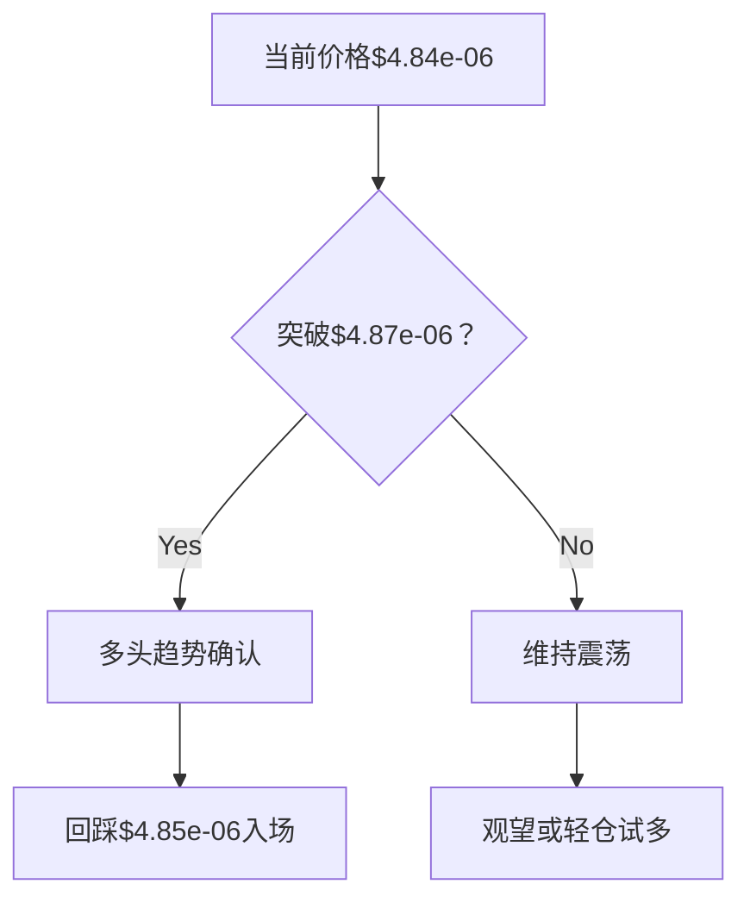
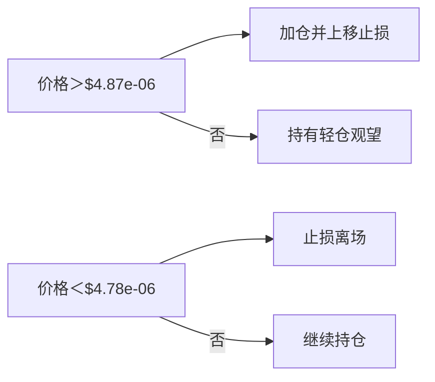

# 实时技术分析报告

## 📊 分析摘要
- 分析模型: deepseek-r1 (聚合分析)
- 最终建议: hold
- 置信度: 0

## 📈 详细分析
```markdown
# PEPEUSDT 综合技术分析报告
**分析时间**：2026-01-29 UTC  
**当前价格**：$4.84e-06  
**主导结论**：中性偏多震荡，短期存在反弹机会但需突破确认  

---

## 🔄 模型观点对比分析
### deepseek核心观点
1. **趋势结构**：  
   - 日线/4小时横盘（强度0-8.71），1小时下行（强度19.52）  
   - 存在时间框架背离，主导趋势为中性震荡  
2. **关键信号**：  
   - 日线/1小时RSI超卖（26.01/21.43）  
   - MACD/布林带数据失效，依赖价格行为分析  
3. **操作建议**：  
   - 激进者轻仓试多（≤10%仓位）  
   - 入场区间：$4.81e-06-$4.84e-06  
   - 止损：$4.78e-06（-1.24%）  
   - 目标：$4.87e-06（+0.62%）→$5.00e-06（+3.31%）  

### qwen核心观点
1. **趋势结构**：  
   - 日线潜在双底雏形 + 4小时三角形收敛  
   - 1小时窄幅震荡（$4.81e-06-$4.87e-06）  
2. **关键信号**：  
   - 日线/1小时RSI超卖共振  
   - 强调$4.70e-06强支撑重要性  
3. **操作建议**：  
   - 突破确认后做多（需1小时收破$4.87e-06 + 4小时收破$4.98e-06）  
   - 入场区间：$4.85e-06-$4.88e-06  
   - 止损：$4.70e-06（-3.1%）  
   - 目标：$4.98e-06（+2.9%）→$5.10e-06（+5.4%）  

---

## ⚖️ 模型异同点总结
| 维度         | deepseek                                | qwen                                      | 共识度 |
|--------------|-----------------------------------------|-------------------------------------------|--------|
| **趋势判断** | 中性横盘主导                           | 横盘+潜在反转形态                         | 高     |
| **关键支撑** | $4.78e-06（近期低点）                  | $4.70e-06（强支撑）+$4.78e-06（分界）    | 中     |
| **RSI解读**  | 超卖暗示反弹                           | 多周期超卖共振强化反弹逻辑                | 高     |
| **入场逻辑** | 当前价格轻仓试多                       | 突破确认后回踩入场                        | 低     |
| **风险控制** | 紧凑止损（$4.78e-06）                  | 宽幅止损（$4.70e-06）                    | 低     |

> 📌 **核心分歧**：  
> - 入场时机：立即轻仓试多 vs 突破确认后入场  
> - 止损策略：近期支撑下方 vs 强支撑下方  

---

## 📌 综合分析结论
1. **趋势状态**：  
   - 长期（日线）：超卖区间震荡，$4.70e-06-$5.00e-06为主要波动范围  
   - 短期（1小时）：下行动能减弱，$4.81e-06形成临时底部  
2. **多空平衡点**：  
   - **多头优势**：日线+1小时RSI超卖共振，$4.78e-06反复测试未破  
   - **空头风险**：1小时趋势尚未逆转，需突破$4.87e-06确认反弹  
3. **关键验证信号**：  
   - ✅ 突破$4.87e-06（1小时阻力）→ 短期趋势反转  
   - ❌ 跌破$4.78e-06 → 下探$4.70e-06支撑  

---

## 💼 综合交易建议
### 决策框架


### 具体执行方案
**推荐策略**：**分阶段建仓**  
1. **第一阶段（轻仓试探）**：  
   - 仓位：≤5%总资金（约0.78 USDT）  
   - 入场：当前价$4.84e-06附近  
   - 止损：$4.78e-06（-1.24%）  
   - 目标：$4.87e-06（+0.62%）  

2. **第二阶段（突破加仓）**：  
   - 触发条件：1小时收盘＞$4.87e-06且RSI＞30  
   - 仓位：追加≤5%（总仓≤10%）  
   - 入场：回踩$4.85e-06-$4.86e-06  
   - 止损：上移至$4.81e-06（盈亏平衡）  
   - 目标：$4.98e-06（+2.89%）→$5.00e-06（+3.31%）  

### 风控参数
| 参数          | 数值           | 依据                     |
|---------------|----------------|--------------------------|
| **最大风险**  | ≤1%总资金      | 单笔止损控制在0.5%-1%    |
| **盈亏比**    | 1：3（理想）   | 止损1.24% vs 目标3.31%   |
| **持仓周期**  | 短线（1-3天）  | Meme币高波动特性         |

---

## ⚠️ 风险收益评估
### 潜在收益场景
- **保守**：$4.87e-06（+0.62%，轻仓获利了结）  
- **中性**：$4.98e-06（+2.89%，达成多周期共振目标）  
- **乐观**：$5.10e-06（+5.37%，突破心理关口引发FOMO）  

### 主要风险
1. **技术指标失效**：  
   - MACD/布林带数据异常降低分析可靠性（需侧重价格行为）  
2. **流动性陷阱**：  
   - 超高成交量但价格停滞（常见于Meme币）  
3. **关键事件风险**：  
   - 交易所上币/下架公告、鲸鱼账户异动等突发消息  

### 风控应对
- **止损硬性要求**：任何仓位必须设置止损  
- **时间止损**：24小时内未突破$4.87e-06则离场  
- **事件监控**：避免重大新闻发布前后交易  

---

## 📅 总结建议
**当前操作**：  
✅ **轻仓建立初始多头头寸**（≤5%仓位，$4.84e-06附近）  
✅ **挂突破单**：1小时收于$4.87e-06上方后回踩加仓  

**关键观察位**：  
- **多头防线**：$4.81e-06（1小时支撑）→$4.78e-06（日线支撑）  
- **空头防线**：$4.87e-06（短期阻力）→$4.98e-06（趋势确认位）  

**最终决策树**：  


> 💎 核心逻辑：利用超卖反弹动能，在严格风控下捕捉短期波动收益。需持续关注1小时图价格结构变化。
```

## 💡 交易建议
- 操作: hold
- 置信度: 0
- 分析理由: 无详细理由

## 🤖 模型详细结果
### deepseek
- 分析: ```markdown
# PEPEUSDT 技术分析报告
**分析时间**：2026-01-29 09:40:15 UTC  
**当前价格**：$4.84e-06 (24小时跌幅：-4.724%)

---

## 📊 多时间框架趋势分析
### 日线图（长期趋势）
- **趋势方向**：横盘（Sideways）  
- **强度**：0（极弱）  
- **关键观察**：连续阴线主导（14阴/6阳），近期低点$4.78e-06形成支撑，高点$5.26e-06构成阻力。  
- **趋势评估**：长期方向不明，RSI超卖（26.01）暗示潜在反弹需求。

### 4小时图（中期趋势）
- **趋势方向**：横盘（Sideways）  
- **强度**：8.71（弱）  
- **关键观察**：价格在$4.78e-06-$5.06e-06区间波动，RSI中性（33.33）。  
- **趋势评估**：中期缺乏明确方向，需突破区间确认趋势。

### 1小时图（短期趋势）
- **趋势方向**：下跌（Down）  
- **强度**：19.52（中等）  
- **关键观察**：连续十字星和阴线，RSI超卖（21.43），价格在$4.81e-06-$4.87e-06窄幅震荡。  
- **趋势评估**：短期下行压力显著，但超卖可能触发反弹。

### 趋势一致性分析
- **共振/背离**：  
  - 日线与4小时图均为横盘，但1小时图下跌，形成**时间框架背离**。  
  - 主导趋势由日线/4小时图定义（横盘），1小时图用于捕捉短期波动机会。  

### 主导趋势判断
- **结论**：中性横盘格局主导，短期下行风险存在但未破坏长期结构。

---

## 🎯 关键价格位（多时间框架综合）
| 类型          | 价格位          | 依据                          |
|---------------|-----------------|-------------------------------|
| **主要支撑位** | $4.78e-06      | 日线近期低点                  |
|               | $4.81e-06      | 1小时图多次测试支撑          |
| **主要阻力位** | $5.00e-06      | 日线前高和心理关口            |
|               | $5.06e-06      | 4小时图前高                  |
| **短期阻力**   | $4.87e-06      | 1小时图近期高点              |
| **关键突破位** | 上破$5.06e-06  | 确认多头趋势                 |
|               | 下破$4.78e-06  | 加速下跌信号                 |

---

## 📈 技术信号解读
### RSI分析
- **日线**：26.01（超卖）→ 反弹概率增加  
- **4小时**：33.33（中性）→ 无明确信号  
- **1小时**：21.43（超卖）→ 短期反弹需求  
- **背离**：日线/1小时超卖 vs 4小时中性，暗示潜在短期反弹机会。

### MACD分析
- **全时间框架**：MACD、Signal、Histogram均为0 → **数据异常或无效信号**，需忽略。

### 均线系统
- **全时间框架**：MA50/MA200数据缺失（NaN）→ 无法评估均线支撑/阻力。

### 布林带分析
- **全时间框架**：上轨/中轨/下轨均为0 → **数据无效**，不可作为参考。

---

## 🔍 图表形态识别
- **日线图**：无显著形态（阴线主导，区间震荡）。  
- **4小时图**：无明确形态，近期大阴线后窄幅整理。  
- **1小时图**：**潜在盘整形态**（连续十字星），需量能配合确认方向。  
- **形态置信度**：低（缺乏成交量数据验证）。

---

## 💡 交易建议
### 推荐操作
**观望为主，激进者可轻仓试多**（需严格止损）。  
**依据**：  
- 日线/1小时RSI超卖提供反弹逻辑  
- 但多时间框架趋势背离限制信号强度  

### 入场条件
1. 1小时图收盘价突破$4.87e-06（短期阻力）  
2. RSI回升至30以上（脱离超卖）  

### 入场区间
$4.81e-06 - $4.84e-06（当前价格附近）  

### 止损位
$4.78e-06（日线支撑下方，风险约1.24%）  

### 止盈目标
- **短期**：$4.87e-06（1小时阻力，+0.62%）  
- **长期**：$5.00e-06（日线阻力，+3.31%）  

### 仓位建议
**≤10%总资金**（信号强度弱，佣金费率0.1%需计入成本）  

---

## ⚠️ 风险提示
1. **时间框架冲突**：日线横盘 vs 1小时下跌，操作需等待共振信号。  
2. **波动性评估**：24小时跌幅-4.7%，短期波动加剧，止损务必严格执行。  
3. **主要风险**：  
   - 指标失效（MACD/布林带数据异常）  
   - 流动性风险（超高成交量但价格未动）  
   - 外部事件（Meme币情绪敏感）  
4. **分析失效条件**：  
   - 价格跌破$4.78e-06 → 加速下跌  
   - 突破$5.06e-06 → 趋势反转  

```

```json
{
  "analysis_summary": {
    "symbol": "PEPEUSDT",
    "timestamp": "2026-01-29 09:40:15 UTC",
    "current_price": 4.84e-06,
    "trend_assessment": "Neutral (Sideways Dominant)",
    "key_levels": {
      "support": [4.78e-06, 4.81e-06],
      "resistance": [5.00e-06, 5.06e-06]
    },
    "indicator_insights": {
      "RSI": "Oversold in Daily/Hourly, Neutral in 4H",
      "MACD": "Invalid Data",
      "MA": "Data Unavailable"
    },
    "trade_recommendation": {
      "action": "Watch or Light Long",
      "entry_zone": [4.81e-06, 4.84e-06],
      "stop_loss": 4.78e-06,
      "take_profit": [4.87e-06, 5.00e-06],
      "position_size": "≤10%"
    },
    "risk_rating": "High (3/5)",
    "critical_risks": [
      "Timeframe Divergence",
      "Invalid Indicator Data",
      "Meme Coin Volatility"
    ]
  }
}
```
- 分析时间: 2026-01-29 17:42:04
- 响应时间: 63.33秒

### qwen
- 分析: # 📊 PEPE/USDT 多时间框架技术分析报告  
**分析时间（UTC）：2026-01-29 09:40:15**  
**当前价格：$4.84e-06**  

---

## 📊 多时间框架趋势分析

### **日线图（长期趋势）**
- **趋势方向**：横盘整理（sideways）  
- **趋势强度**：0（无明显动量）  
- **K线结构**：近20根K线中阴线占优（14根），显示卖压主导，但近期连续两根阴线后未进一步破位，表明下跌动能减弱。  
- **支撑/阻力评估**：  
  - **关键支撑**：$4.70e-06（近5日最低点，多次测试）  
  - **关键阻力**：$5.00e-06（心理关口 + 近期高点区域）

### **4小时图（中期趋势）**
- **趋势方向**：横盘整理（sideways）  
- **趋势强度**：8.71（极弱）  
- **K线结构**：阳线略多于阴线（12 vs 7），但最近3根K线呈现“冲高回落”结构，显示上方抛压仍存。  
- **支撑/阻力评估**：  
  - **支撑**：$4.78e-06（最近低点）  
  - **阻力**：$4.98e-06–$5.00e-06（前高密集区）

### **1小时图（短期趋势）**
- **趋势方向**：下行（down）  
- **趋势强度**：19.52（弱下行）  
- **K线结构**：近期连续出现十字星（第1、2、5根），配合一根小阴线，显示多空僵持，但整体处于窄幅震荡下沿。  
- **支撑/阻力评估**：  
  - **即时支撑**：$4.81e-06（近期低点）  
  - **即时阻力**：$4.87e-06（近期高点）

### **趋势一致性分析**
- **无明确共振**：日线与4小时图均呈横盘，但1小时图显示弱下行，存在轻微**短期背离**（长周期无方向 vs 短期偏空）。  
- **主导趋势判断**：以日线和4小时图为准，市场处于**区间震荡**状态，1小时图的下行仅为短期回调，不具备独立趋势意义。

---

## 🎯 关键价格位（多时间框架综合）

| 类型 | 价格（USDT） | 依据 |
|------|---------------|------|
| **主要支撑位 1** | $4.70e-06 | 日线图近5日最低点，强心理+技术支撑 |
| **主要支撑位 2** | $4.78e-06 | 4小时图近期低点，短期多空分界 |
| **主要阻力位 1** | $4.98e-06 | 4小时图前高，日线近期反弹高点 |
| **主要阻力位 2** | $5.00e-06 | 心理整数关口 + 日线布林上轨预期位（虽数据缺失，但历史高点集中于此） |
| **短期支撑** | $4.81e-06 | 1小时图近期低点，日内多空平衡下沿 |
| **短期阻力** | $4.87e-06 | 1小时图近期高点，日内多空平衡上沿 |
| **关键突破位** | **上破 $5.00e-06** 或 **下破 $4.70e-06** | 将打破当前横盘格局，确认新趋势 |

> 注：布林带与均线数据缺失（显示为0或nan），无法用于精确突破位计算，故以历史高低点替代。

---

## 📈 技术信号解读（多时间框架对比）

### **RSI分析**
| 时间框架 | RSI值 | 状态 | 解读 |
|----------|--------|------|------|
| 1小时 | 21.43 | **超卖** | 短期严重超卖，存在反弹需求 |
| 4小时 | 33.33 | 中性偏弱 | 未达超卖，但接近阈值（30） |
| 日线 | 26.01 | **超卖** | 长期超卖，暗示下跌动能衰竭 |

✅ **多周期超卖共振**：日线与1小时同时进入超卖区，**强烈暗示反弹可能性**，尤其若价格守住$4.70e-06支撑。

### **MACD分析**
- 所有时间框架MACD、Signal、Histogram均显示为 **-0.0000**，表明：
  - 指标可能因价格精度（科学计数法）或平台计算限制而失效。
  - **无法依赖MACD判断动能或交叉信号**，需以价格行为和RSI为主。

### **均线系统**
- MA200、MA50等均线数据缺失（nan），**无法评估均线支撑/阻力作用**。

### **布林带分析**
- 所有时间框架布林带数值为0，**数据不可用**，无法判断波动率压缩或扩张状态。

> ⚠️ **指标局限性**：由于PEPE价格极低（微单位），多数技术指标因浮点精度问题失效，**应优先依赖价格结构、K线形态与RSI**。

---

## 🔍 图表形态识别

### **日线图形态**
- **潜在双底雏形**：  
  - 第5根K线低点 $4.61e-06 → 第1根K线低点 $4.78e-06（未创新低）  
  - 若价格站稳 $4.84e-06 并突破 $5.00e-06，可确认双底反转。  
- **置信度**：中低（需更多K线确认，且量能数据缺失）

### **4小时图形态**
- **对称三角形收敛**：  
  - 高点下移（$5.06e-06 → $5.00e-06 → $4.98e-06）  
  - 低点上移（$4.70e-06 → $4.78e-06 → $4.79e-06）  
  - 当前价格位于三角形下沿，**临近变盘点**。  
- **置信度**：中（形态清晰，但缺乏成交量验证）

### **1小时图形态**
- **窄幅震荡区间**：$4.81e-06 – $4.87e-06，连续十字星显示犹豫。  
- **潜在启明星/锤子线**：第4根阳线（+0.62%）从低位拉起，但未伴随放量，**形态弱**。

### **形态确认**
- **量能配合缺失**：无成交量或资金流数据，无法验证突破有效性。  
- **综合置信度**：**中等偏低**，需等待价格突破关键位确认。

---

## 💡 交易建议（基于多时间框架共振）

### **推荐操作**：**观望 + 准备做多**  
- 理由：日线与1小时RSI超卖 + 价格接近强支撑，但缺乏明确突破信号。

### **入场条件**（需同时满足）：
1. **1小时图**：价格站稳 $4.87e-06 并收于其上（确认短期阻力突破）  
2. **4小时图**：K线收于 $4.98e-06 上方（确认中期阻力突破）  
3. **RSI**：1小时RSI回升至30以上（脱离超卖）

### **入场区间**：**$4.85e-06 – $4.88e-06**（突破确认后回踩）

### **止损位**：**$4.70e-06**（日线强支撑下方，约-3.1%风险）

### **止盈目标**：
- **TP1（短期）**：$4.98e-06（4小时阻力，+2.9%）  
- **TP2（长期）**：$5.10e-06（日线前高，+5.4%）

### **仓位建议**：
- 因信号强度中等、指标部分失效，建议**轻仓（≤10% 总资产）**  
- 当前总资产15.59 USDT，建议开仓 ≤1.5 USDT（约31万枚PEPE）

> 💰 **佣金影响**：买卖费率均为0.1%，单次往返成本0.2%，对短线交易影响显著，**不建议频繁操作**。

---

## ⚠️ 风险提示

### **时间框架冲突**
- 1小时图偏空 vs 日线/4小时横盘，若价格跌破$4.78e-06，可能引发短期加速下跌，需严格止损。

### **当前市场波动性评估**
- 日线ATR估算：近期波幅约 $0.4e-06（$4.61e-06 – $5.06e-06），**波动率中等**，适合区间策略。

### **需警惕的主要风险**
1. **指标失效**：MACD/布林带/均线数据不可用，降低技术分析可靠性。  
2. **流动性风险**：PEPE为 meme 币，易受情绪驱动，技术面可能被突发消息覆盖。  
3. **无资金流数据**：无法判断主力资金动向，增加误判概率。

### **分析失效条件**
- **价格跌破 $4.70e-06**：日线支撑失守，双底形态破坏，转为空头。  
- **价格快速拉升突破 $5.10e-06 无回踩**：可能进入FOMO行情，技术分析滞后。  
- **RSI持续低于20且价格创新低**：超卖失效，进入“下跌中继”模式。

---

## ✅ 结论
当前PEPE/USDT处于**关键支撑区的超卖震荡**状态。多时间框架RSI超卖提供反弹基础，但缺乏动能指标与量能确认。**建议等待价格突破$4.87e-06并站稳后轻仓试多，严格止损于$4.70e-06下方**。若跌破支撑，则放弃多头思路，等待新低后重新评估。

---

```json
{
  "symbol": "PEPEUSDT",
  "analysis_time_utc": "2026-01-29T09:40:15Z",
  "current_price": 4.84e-06,
  "trend_analysis": {
    "daily": {
      "direction": "sideways",
      "strength": 0,
      "support": [4.7e-06, 4.78e-06],
      "resistance": [4.98e-06, 5.0e-06]
    },
    "four_hour": {
      "direction": "sideways",
      "strength": 8.71,
      "support": [4.78e-06],
      "resistance": [4.98e-06]
    },
    "one_hour": {
      "direction": "down",
      "strength": 19.52,
      "support": [4.81e-06],
      "resistance": [4.87e-06]
    },
    "consensus": "no strong consensus, short-term bearish bias within long-term range"
  },
  "key_levels": {
    "major_support": [4.7e-06, 4.78e-06],
    "major_resistance": [4.98e-06, 5.0e-06],
    "short_term_support": 4.81e-06,
    "short_term_resistance": 4.87e-06,
    "breakout_levels": {
      "bullish": 5.0e-06,
      "bearish": 4.7e-06
    }
  },
  "technical_signals": {
    "rsi": {
      "one_hour": {"value": 21.43, "status": "oversold"},
      "four_hour": {"value": 33.33, "status": "neutral"},
      "daily": {"value": 26.01, "status": "oversold"}
    },
    "macd": {
      "reliable": false,
      "reason": "All values reported as -0.0000, likely due to precision issues"
    },
    "moving_averages": {
      "reliable": false,
      "reason": "MA200/MA50 reported as nan"
    },
    "bollinger_bands": {
      "reliable": false,
      "reason": "All bands reported as 0.0000"
    }
  },
  "chart_patterns": {
    "daily": "Potential double bottom (low confidence)",
    "four_hour": "Symmetrical triangle (medium confidence)",
    "one_hour": "Narrow range with indecision candles"
  },
  "trading_recommendation": {
    "action": "watch and prepare for long",
    "entry_conditions": [
      "Price closes above 4.87e-06 on 1H",
      "Price holds above 4.98e-06 on 4H",
      "1H RSI > 30"
    ],
    "entry_zone": [4.85e-06, 4.88e-06],
    "stop_loss": 4.7e-06,
    "take_profit": {
      "tp1": 4.98e-06,
      "tp2": 5.1e-06
    },
    "position_size": "≤10% of account (≤1.5 USDT)"
  },
  "risk_warnings": {
    "timeframe_conflict": "1H downtrend vs higher TF sideways",
    "volatility": "Medium",
    "key_risks": [
      "Indicator unreliability due to low price precision",
      "Lack of volume/funding data",
      "Meme coin sentiment risk"
    ],
    "invalidation_conditions": [
      "Close below 4.7e-06 invalidates bullish setup",
      "RSI < 20 with new lows suggests bear continuation"
    ]
  }
}
```
- 分析时间: 2026-01-29 17:42:20
- 响应时间: 79.01秒

## ⚠️ 风险分析
- 市场风险: 加密货币市场波动较大，请谨慎交易
- 模型风险: AI模型分析基于历史数据，可能无法预测突发市场事件
- 执行风险: 交易执行价格可能与分析时的价格存在差异

## 📝 交易策略建议
1. **资金管理**: 建议使用不超过总资金20%的资金进行单笔交易
2. **止损设置**: 建议设置5-10%的止损位，控制单笔交易风险
3. **止盈设置**: 建议设置15-30%的止盈位，确保收益
4. **仓位管理**: 根据市场波动性调整仓位大小
5. **监控频率**: 建议至少每4小时监控一次交易情况

## 📄 免责声明
本分析报告仅供参考，不构成任何投资建议。
交易决策请结合个人风险承受能力和市场实际情况。
过往表现不代表未来结果，投资有风险，入市需谨慎。