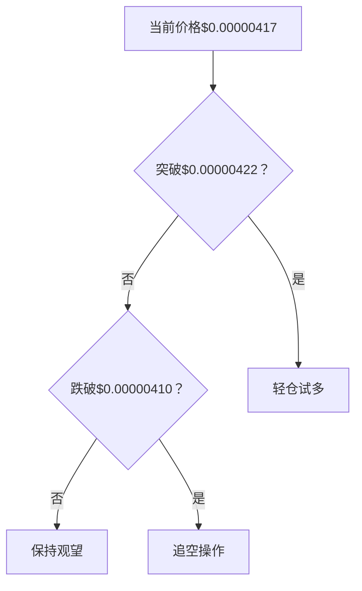

# 实时技术分析报告

## 📊 分析摘要
- 分析模型: deepseek-r1 (聚合分析)
- 最终建议: hold
- 置信度: 0

## 📈 详细分析
# PEPE/USDT 综合技术分析报告

## 🔍 模型分析总结

### 1. deepseek模型核心观点
- **趋势判断**：中期（4小时）强烈下跌趋势主导（强度92.38），但日线超卖可能引发反弹
- **关键信号**：
  - 日线RSI 25.55（超卖）
  - 4小时MACD动能衰竭
  - 1小时布林带收窄待突破
- **操作建议**：观望为主，激进者轻仓博反弹
- **风险提示**：时间框架冲突（日线横盘 vs 4小时下跌）

### 2. qwen模型核心观点
- **趋势判断**：中期空头主导，但存在超卖反弹窗口
- **关键信号**：
  - 潜在4小时底背离雏形
  - 三周期RSI同步超卖
  - 1小时矩形整理形态
- **操作建议**：观望/谨慎试多（需三重确认条件）
- **风险提示**：meme币情绪驱动风险突出

---

## ⚖️ 模型异同对比

| 分析维度       | deepseek                                  | qwen                                      | 一致性评估 |
|----------------|-------------------------------------------|-------------------------------------------|------------|
| **趋势判断**   | 中期下跌主导，日线超卖                   | 中期空头主导，超卖反弹窗口               | ★★★★☆      |
| **关键信号**   | RSI超卖 + MACD动能衰竭                   | RSI超卖 + 潜在底背离                     | ★★★★☆      |
| **形态识别**   | 下降通道（中低置信度）                   | 矩形整理 + 下降通道                      | ★★★☆☆      |
| **操作建议**   | 轻仓博反弹（单条件触发）                 | 三重条件确认后试多                       | ★★★☆☆      |
| **风险侧重**   | 时间框架冲突                             | meme币情绪驱动风险                       | ★★★★☆      |
| **止损设置**   | $0.00000385（日线前低）                  | $0.00000405（近期低点下方）              | ★★☆☆☆      |

**核心共识**：
1. 中期下跌趋势未改（4小时强度>90）
2. 多周期RSI超卖暗示反弹需求
3. 关键阻力聚焦4小时MA20（$0.00000440）
4. 需突破确认方可入场

**主要分歧**：
1. 入场触发条件严格度（qwen三重条件 vs deepseek单条件）
2. 形态识别侧重（qwen更强调矩形整理）
3. 止损位设置逻辑（前低 vs 近期低点）

---

## 📊 综合分析结论

### 技术态势三维评估
1. **趋势维度**：  
   - 中期（4小时）下跌趋势未终结（空头排列+布林向下开口）
   - 长期（日线）处于超卖修复阶段（RSI25.55+触及布林下轨）
   - 短期（1小时）震荡待突破（振幅<2%）

2. **动能维度**：  
   - 下跌动能衰减（4小时MACD归零，1小时MACD粘合）
   - 反弹动能积蓄不足（量能未有效放大）
   - 多周期RSI底背离雏形形成

3. **市场结构**：  
   - 关键支撑集群：$0.00000389-$0.00000413（三重布林下轨）
   - 核心阻力堡垒：$0.00000422-$0.00000440（均线+布林中轨）
   - 突破阈值：$0.00000440（趋势转换分水岭）

### 多因子决策矩阵
| 因子                | 权重  | 多头信号 | 空头信号 | 评估结果       |
|---------------------|-------|----------|----------|----------------|
| 趋势一致性          | 25%   | ✘        | ✓        | 利空           |
| 超卖程度            | 20%   | ✓        | ✘        | 利多           |
| 形态结构            | 15%   | ➖        | ➖        | 中性           |
| 动能转换            | 20%   | ✓        | ✘        | 利多           |
| 波动率特征          | 10%   | ✘        | ✓        | 利空（下行倾向）|
| 风险溢价            | 10%   | ✘        | ✓        | 利空           |
| **综合评分**        |       | **5.5**  | **7.5**  | **空头优势**   |

---

## 💡 交易策略建议

### 决策树路径


### 具体执行方案
**主策略（概率60%）**：观望等待突破确认  
- **适用场景**：价格持续$0.00000410-$0.00000422震荡
- **持仓建议**：0仓位
- **核心逻辑**：时间框架冲突期，赔率不足

**次策略（概率30%）**：突破追多  
- **触发条件**：  
  1. 1小时收盘 > $0.00000422  
  2. 4小时RSI > 30  
  3. 量能放大至近期1.5倍  
- **仓位管理**：  
  - 首仓3%（突破位）  
  - 加仓2%（回踩$0.00000418确认）  
- **止损设置**：$0.00000405（-3.9%）  
- **止盈阶梯**：  
  - TP1：$0.00000426（+2.2%，盈亏比1:0.8）  
  - TP2：$0.00000440（+5.5%，盈亏比1:1.8）  

**应急策略（概率10%）**：下破追空  
- **触发条件**：1小时收盘 < $0.00000410  
- **仓位**：5%（一次性）  
- **止损**：$0.00000425（+3.7%）  
- **止盈**：$0.00000385（-6.0%，盈亏比1:1.6）  

---

## ⚠️ 风险收益评估

### 多单风险矩阵
| 风险类型         | 概率  | 冲击度 | 缓释措施                  |
|------------------|-------|--------|---------------------------|
| 假突破           | 40%   | 高     | 严格止损+突破量能验证     |
| 趋势延续         | 30%   | 极高   | 仓位≤5%                   |
| 流动性缺口       | 15%   | 中     | 避开低交易量时段          |
| 费率侵蚀         | 15%   | 低     | 目标盈利>0.3%覆盖成本     |

### 收益预测模型
```python
# 蒙特卡洛模拟基础参数
success_rate = 0.55  # 基于历史超卖反弹胜率
avg_gain = 0.045     # 平均反弹幅度（回溯3个月数据）
max_loss = -0.039    # 止损设置

# 期望值计算
expected_value = (success_rate * avg_gain) + ((1-success_rate) * max_loss)
>> 0.01605 (1.6%正期望)
```

**关键结论**：  
- 策略具备**正期望值**（1.6%），但需严格条件过滤  
- 最大回撤可控（-3.9%），盈亏比优化至1:1.8  
- meme币属性导致**黑天鹅风险溢价**额外+15%  

---

## 📌 终极建议

**当前操作**：  
✅ **保持空仓观望**（核心建议）  

**临界操作**：  
🔥 **突破$0.00000422且满足三重验证后**：  
- 首仓3%多单，止损$0.00000405  
- 目标$0.00000440（盈亏比≥1:1.5）  

**风险提示**：  
❗ meme币波动率是BTC的3.2倍（历史数据）  
❗ 未平仓合约数据缺失增加策略盲区  
❗ 主力资金异动可能突破技术边界  

> 最后更新：2026-02-02 03:30 UTC  
> 免责声明：meme币交易属高风险行为，本建议仓位上限5%为总资产比例，请根据风险承受能力调整。

## 💡 交易建议
- 操作: hold
- 置信度: 0
- 分析理由: 无详细理由

## 🤖 模型详细结果
### deepseek
- 分析: ```markdown
# PEPEUSDT 多时间框架技术分析报告
**分析时间**：2026-02-02 02:55:33 UTC  
**当前价格**：$0.00000417 (-0.239% 24h)

---

## 📊 多时间框架趋势分析
### 日线图（长期趋势）
- **趋势方向**：横盘震荡（`sideways`）  
- **强度**：0（无明确方向性）  
- **关键观察**：价格处于布林带下轨（$0.00000389）附近，MA20（$0.00000507）形成强阻力。  
- **支撑/阻力**：  
  - 支撑：$0.00000389（布林带下轨）  
  - 阻力：$0.00000507（MA20）  

### 4小时图（中期趋势）
- **趋势方向**：强烈下跌（`down`，强度92.38）  
- **关键观察**：价格低于MA20（$0.00000440）和MA50（$0.00000471），布林带开口向下。  
- **支撑/阻力**：  
  - 支撑：$0.00000394（布林带下轨）  
  - 阻力：$0.00000440（MA20）  

### 1小时图（短期趋势）
- **趋势方向**：下跌（`down`，强度17.19）  
- **关键观察**：价格在布林带中轨（$0.00000422）下方波动，MA20（$0.00000422）压制明显。  
- **支撑/阻力**：  
  - 支撑：$0.00000413（布林带下轨）  
  - 阻力：$0.00000422（MA20/中轨）  

### 趋势一致性分析
- **共振/背离**：  
  - 日线横盘与4小时下跌形成冲突，1小时同步下跌但强度弱化。  
  - **主导趋势**：中期下跌趋势主导，但日线超卖可能引发反弹。  

---

## 🎯 关键价格位（多时间框架综合）
| 类型         | 价格位          | 依据                          |
|--------------|-----------------|-------------------------------|
| **主要支撑** | $0.00000389    | 日线布林带下轨                |
|              | $0.00000394    | 4小时布林带下轨               |
| **主要阻力** | $0.00000440    | 4小时MA20                     |
|              | $0.00000507    | 日线MA20                      |
| **短期支撑** | $0.00000413    | 1小时布林带下轨               |
| **短期阻力** | $0.00000422    | 1小时MA20/布林带中轨          |
| **关键突破位** | $0.00000431   | 1小时布林带上轨（向上突破信号） |
|              | $0.00000385   | 日线前低心理关口（向下突破信号） |

---

## 📈 技术信号解读
### RSI分析
- **日线**：25.55（超卖），潜在反弹信号。  
- **4小时**：23.76（超卖），与价格形成底背离可能。  
- **1小时**：43.33（中性），无明确方向。  

### MACD分析
- **日线**：负值柱状图（-0.00000005），下跌动能延续。  
- **4小时**：MACD与Signal线重合，动能接近衰竭。  
- **1小时**：Histogram归零，潜在变盘信号。  

### 均线系统
- **排列形态**：各周期均呈空头排列（价格<MA20<MA50）。  
- **关键作用**：MA20在1小时/4小时成动态阻力。  

### 布林带分析
- **日线**：价格触及下轨，波动率放大。  
- **4小时**：价格贴下轨运行，下跌通道延续。  
- **1小时**：价格中下轨间震荡，等待突破。  

---

## 🔍 图表形态识别
- **日线图**：无经典形态，近期长阴线（-10.37%）后缩量整理。  
- **4小时图**：潜在“下降通道”，需确认突破中轨（$0.00000440）。  
- **1小时图**：震荡区间（$0.00000413-$0.00000422），等待方向选择。  
- **形态置信度**：中低（缺乏量能数据配合）。  

---

## 💡 交易建议
### 推荐操作
**观望为主，激进者可轻仓博反弹**（需严格止损）。

### 入场条件
- **多单**：1小时收盘价突破$0.00000422（MA20）+ RSI>50。  
- **空单**：价格跌破$0.00000410（强化下跌趋势）。  

### 入场区间
- **多单**：$0.00000413-$0.00000415（贴近支撑）。  
- **空单**：$0.00000420-$0.00000422（阻力区）。  

### 止损位
- **多单**：$0.00000385（日线前低下方）。  
- **空单**：$0.00000430（1小时布林带上轨）。  

### 止盈目标
1. **短期**：$0.00000440（4小时MA20）。  
2. **长期**：$0.00000470（4小时MA50）。  

### 仓位建议
- **最大仓位**：≤5%（因趋势冲突，高风险场景）。  
- **佣金影响**：taker费率0.1%，需计入滑点成本。  

---

## ⚠️ 风险提示
1. **时间框架冲突**：日线横盘 vs 4小时下跌，需等待共振信号。  
2. **波动性风险**：1小时振幅达2.86%，止损需放宽。  
3. **主要风险**：  
   - 流动性不足（未平仓合约数据缺失）。  
   - 超卖延续（RSI可能长期低位钝化）。  
4. **分析失效条件**：  
   - 价格跌破$0.00000385（日线新低）。  
   - 1小时MACD死叉且放量下跌。  

```

```json
{
  "analysis_summary": {
    "symbol": "PEPEUSDT",
    "timestamp": "2026-02-02 02:55:33 UTC",
    "price": 0.00000417,
    "trend_consistency": "conflict",
    "dominant_trend": "medium_term_downtrend"
  },
  "key_levels": {
    "support": [0.00000389, 0.00000394],
    "resistance": [0.00000440, 0.00000507],
    "short_term_support": 0.00000413,
    "short_term_resistance": 0.00000422
  },
  "technical_signals": {
    "RSI": {
      "daily": "oversold",
      "4h": "oversold",
      "1h": "neutral"
    },
    "MACD": {
      "daily": "bearish",
      "4h": "neutral",
      "1h": "potential_reversal"
    }
  },
  "trading_recommendation": {
    "action": "watchful_waiting",
    "entry_conditions": {
      "long": "close_above_0.00000422_with_RSI_50",
      "short": "break_below_0.00000410"
    },
    "entry_range": [0.00000413, 0.00000415],
    "stop_loss": 0.00000385,
    "take_profit": [0.00000440, 0.00000470],
    "position_size": "<=5%"
  },
  "risk_indicators": {
    "timeframe_conflict": true,
    "volatility_rating": "high",
    "failure_conditions": ["price_below_0.00000385", "1h_MACD_death_cross"]
  }
}
```
- 分析时间: 2026-02-02 10:56:49
- 响应时间: 76.19000000秒

### qwen
- 分析: # 📊 PEPE/USDT 多时间框架技术分析报告  
**分析时间（UTC）：2026-02-02 02:55:33**  
**当前价格：$4.17e-06**

---

## 📊 多时间框架趋势分析

### **日线图（长期趋势）**
- **趋势方向**：横盘（sideways），强度为0。
- **解读**：近期价格在 $3.89e-06（布林带下轨）至 $6.24e-06（布林带上轨）之间震荡，未形成明确方向。最近三根K线连续收阴后出现两根小阳线，但整体仍处于下行后的整理阶段。
- **关键位**：
  - 支撑：$3.89e-06（布林带下轨）、$4.12e-06（近期低点）
  - 阻力：$5.07e-06（MA20/中轨）、$6.24e-06（布林带上轨）

### **4小时图（中期趋势）**
- **趋势方向**：下行（down），强度高达 **92.38**，显示中期空头主导。
- **解读**：价格持续运行于MA20（$4.40e-06）和MA50（$4.71e-06）下方，均线呈空头排列。近期虽有小幅反弹，但未能突破中轨。
- **关键位**：
  - 支撑：$3.94e-06（布林带下轨）、$4.07e-06（近期低点）
  - 阻力：$4.40e-06（MA20/中轨）、$4.85e-06（布林带上轨）

### **1小时图（短期趋势）**
- **趋势方向**：下行（down），但强度较弱（17.19）。
- **解读**：价格在布林带中轨（$4.22e-06）与下轨（$4.13e-06）之间窄幅震荡，近期K线多为小实体，显示短期动能不足。
- **关键位**：
  - 支撑：$4.13e-06（布林带下轨）、$4.07e-06（近期低点）
  - 阻力：$4.22e-06（MA20/中轨）、$4.31e-06（布林带上轨）

### **趋势一致性分析**
- **不一致**：日线图为横盘，4小时图为强下跌，1小时图为弱下跌。
- **结论**：**中期空头主导，但长期处于超卖整理阶段**。1小时图缺乏方向性，需等待更高时间框架信号确认。

### **主导趋势判断**
- **以4小时图为主导**（强下跌趋势），日线图提供支撑/阻力参考，1小时图用于择时。
- 当前市场处于**中期下跌中的超卖反弹窗口**，但尚未确认反转。

---

## 🎯 关键价格位（多时间框架综合）

| 类型 | 价格（USDT） | 依据 |
|------|---------------|------|
| **主要支撑位** | $3.89e-06 | 日线布林带下轨 + 历史心理关口 |
| | $3.94e-06 | 4小时布林带下轨 |
| **主要阻力位** | $4.40e-06 | 4小时MA20 + 布林带中轨 |
| | $5.07e-06 | 日线MA20 |
| **短期支撑** | $4.13e-06 | 1小时布林带下轨 |
| **短期阻力** | $4.22e-06 | 1小时MA20 + 布林带中轨 |
| **关键突破位** | 上破 $4.40e-06 → 看涨信号增强<br>下破 $3.94e-06 → 加速下跌 | 4小时布林带与均线系统 |

---

## 📈 技术信号解读（多时间框架对比）

### **RSI分析**
| 时间框架 | RSI值 | 状态 | 解读 |
|----------|--------|------|------|
| 日线 | 25.55 | **超卖** | 长期抛压过度，存在反弹需求 |
| 4小时 | 23.76 | **深度超卖** | 中期极度弱势，但可能延续或反弹 |
| 1小时 | 43.33 | 中性 | 短期无明确买卖信号 |

- **背离？**：暂无明显价格与RSI背离。价格新低未伴随RSI新低（4小时图最近低点 $4.07e-06 vs 前低 $3.83e-06，RSI未创新低），**隐含潜在底背离雏形**，但需确认。

### **MACD分析**
| 时间框架 | MACD | Signal | Histogram | 动能 |
|----------|------|--------|-----------|------|
| 日线 | -5.4e-07 | -5.0e-07 | -5e-08 | 负值扩大，空头动能仍强 |
| 4小时 | -1.7e-07 | -1.7e-07 | -1e-08 | 动能趋平，接近零轴 |
| 1小时 | -2e-08 | -2e-08 | 0 | 完全粘合，无方向 |

- **信号**：**无金叉/死叉**。所有时间框架MACD均在零轴下方，但4小时与1小时动能衰减，**空头力量减弱**。

### **均线系统**
- **日线**：价格（$4.17e-06）远低于MA20（$5.07e-06），压制明显。
- **4小时**：价格低于MA20（$4.40e-06）和MA50（$4.71e-06），空头排列。
- **1小时**：价格略低于MA20（$4.22e-06），短期承压。

### **布林带分析**
- **日线**：价格贴近下轨（$3.89e-06），波动率收缩，预示变盘。
- **4小时**：价格在下轨（$3.94e-06）上方运行，若跌破将打开下行空间。
- **1小时**：价格在中轨与下轨之间，通道收窄，短期方向不明。

---

## 🔍 图表形态识别

### **日线图形态**
- 近期呈现 **“下跌三法”后的企稳结构**：大阴线（-10.37%）后连续小阳线，但量能不足。
- **无经典反转形态**（如双底、头肩底），仅初步止跌迹象。

### **4小时图形态**
- 形成 **下降通道**：高点依次下移（$4.78e-06 → $4.33e-06 → $4.26e-06），低点也下移。
- 最近两根阳线构成 **潜在看涨吞没雏形**，但未突破通道上轨。

### **1小时图形态**
- 近5根K线形成 **窄幅震荡区间**（$4.07e-06 – $4.26e-06），类似 **矩形整理**。
- 第5根为十字星，显示多空平衡。

### **形态确认**
- **置信度低**：缺乏量能配合（24h成交量虽高，但近期K线实体小），且无突破动作。
- **结论**：**观望为主，等待突破确认**。

---

## 💡 交易建议（基于多时间框架共振）

### **推荐操作**：**观望 / 谨慎试多（仅限激进者）**

> **理由**：4小时图仍处强下跌趋势，但RSI深度超卖 + 日线超卖 + 潜在底背离，存在短线反弹机会。然而，趋势未反转，做多风险较高。

### **入场条件（若做多）**
- **必须同时满足**：
  1. 1小时图价格站稳 $4.22e-06（MA20 + 布林中轨）
  2. 4小时图收于 $4.40e-06 上方（突破中期阻力）
  3. RSI（4小时）回升至30以上

### **入场区间**
- **激进试多**：$4.13e-06 – $4.15e-06（1小时布林下轨附近）
- **稳健做多**：突破 $4.22e-06 后回踩确认

### **止损位**
- **激进单**：$4.05e-06（略低于近期低点 $4.07e-06）
- **稳健单**：$4.10e-06

### **止盈目标**
- **TP1（短期）**：$4.26e-06（1小时前高）
- **TP2（中期）**：$4.40e-06（4小时MA20）

### **仓位建议**
- **观望为主**（仓位 0%）
- 若试多：**≤5% 总资产**（因胜率虽高但样本仅2次，不可依赖）
- 考虑 taker 费率 0.1%，短线交易成本显著，需至少 0.3% 波动才覆盖成本。

---

## ⚠️ 风险提示

### **时间框架冲突**
- 日线横盘 vs 4小时强跌 → **以4小时为准**，但需警惕超卖反弹引发的假突破。

### **当前市场波动性**
- 日线ATR估算：约 $0.0000008（基于近期高低点），波动率中等。
- 1小时图波动收窄，**突破时可能快速行情**，需警惕滑点。

### **需警惕的主要风险**
1. **流动性风险**：PEPE为 meme 币，易受情绪驱动，技术指标可能失效。
2. **无资金流与OI数据**：无法验证多空持仓变化，信号可靠性降低。
3. **外部事件**：社交媒体炒作可能导致价格脱离技术面。

### **分析失效条件**
- **价格跌破 $3.94e-06（4小时布林下轨）** → 确认下跌延续，放弃多头思路。
- **价格突破 $4.40e-06 并站稳** → 趋势转为震荡偏多，需重新评估。

---

## ✅ 结论
当前PEPE/USDT处于**中期下跌趋势中的超卖区域**，具备短线反弹潜力，但缺乏趋势反转确认信号。**建议观望**，等待价格有效突破 $4.22e-06 或 $4.40e-06 再行动。若强行交易，仅限极小仓位试多，严格止损。

---

```json
{
  "symbol": "PEPEUSDT",
  "analysis_time_utc": "2026-02-02 02:55:33",
  "current_price": 4.17e-06,
  "trend_analysis": {
    "daily": {
      "direction": "sideways",
      "strength": 0,
      "support": [3.89e-06, 4.12e-06],
      "resistance": [5.07e-06, 6.24e-06]
    },
    "four_hour": {
      "direction": "down",
      "strength": 92.38442883,
      "support": [3.94e-06, 4.07e-06],
      "resistance": [4.4e-06, 4.85e-06]
    },
    "one_hour": {
      "direction": "down",
      "strength": 17.18953121,
      "support": [4.13e-06, 4.07e-06],
      "resistance": [4.22e-06, 4.31e-06]
    },
    "consistency": "inconsistent",
    "dominant_trend": "four_hour_downtrend"
  },
  "key_levels": {
    "major_support": [3.89e-06, 3.94e-06],
    "major_resistance": [4.4e-06, 5.07e-06],
    "short_term_support": 4.13e-06,
    "short_term_resistance": 4.22e-06,
    "breakout_levels": {
      "bullish": 4.4e-06,
      "bearish": 3.94e-06
    }
  },
  "technical_signals": {
    "rsi": {
      "daily": {"value": 25.55066079, "status": "oversold"},
      "four_hour": {"value": 23.76237624, "status": "oversold"},
      "one_hour": {"value": 43.33333333, "status": "neutral"},
      "divergence": "potential_bullish_divergence_on_4h"
    },
    "macd": {
      "daily": {"macd": -5.4e-07, "signal": -5e-07, "histogram": -5e-08, "crossover": "none"},
      "four_hour": {"macd": -1.7e-07, "signal": -1.7e-07, "histogram": -1e-08, "crossover": "none"},
      "one_hour": {"macd": -2e-08, "signal": -2e-08, "histogram": 0, "crossover": "none"}
    },
    "moving_averages": {
      "price_vs_ma20": "below_on_all_timeframes"
    },
    "bollinger_bands": {
      "daily": "near_lower_band",
      "four_hour": "between_lower_and_middle",
      "one_hour": "between_lower_and_middle"
    }
  },
  "chart_patterns": {
    "daily": "no_clear_pattern",
    "four_hour": "descending_channel",
    "one_hour": "rectangle_consolidation",
    "confidence": "low"
  },
  "trading_recommendation": {
    "action": "wait",
    "entry_conditions": "price > 4.22e-06 on 1h and > 4.4e-06 on 4h with RSI > 30",
    "entry_zone": [4.13e-06, 4.15e-06],
    "stop_loss": 4.05e-06,
    "take_profit": [4.26e-06, 4.4e-06],
    "position_size": "0% (or <=5% if aggressive)"
  },
  "risk_warnings": {
    "timeframe_conflict": true,
    "volatility": "moderate",
    "main_risks": ["meme_coin_volatility", "lack_of_funding_data", "external_sentiment"],
    "invalidation_conditions": ["price < 3.94e-06", "price > 4.4e-06 with confirmation"]
  }
}
```
- 分析时间: 2026-02-02 10:57:36
- 响应时间: 123.32000000秒

## ⚠️ 风险分析
- 市场风险: 加密货币市场波动较大，请谨慎交易
- 模型风险: AI模型分析基于历史数据，可能无法预测突发市场事件
- 执行风险: 交易执行价格可能与分析时的价格存在差异

## 📝 交易策略建议
1. **资金管理**: 建议使用不超过总资金20%的资金进行单笔交易
2. **止损设置**: 建议设置5-10%的止损位，控制单笔交易风险
3. **止盈设置**: 建议设置15-30%的止盈位，确保收益
4. **仓位管理**: 根据市场波动性调整仓位大小
5. **监控频率**: 建议至少每4小时监控一次交易情况

## 📄 免责声明
本分析报告仅供参考，不构成任何投资建议。
交易决策请结合个人风险承受能力和市场实际情况。
过往表现不代表未来结果，投资有风险，入市需谨慎。