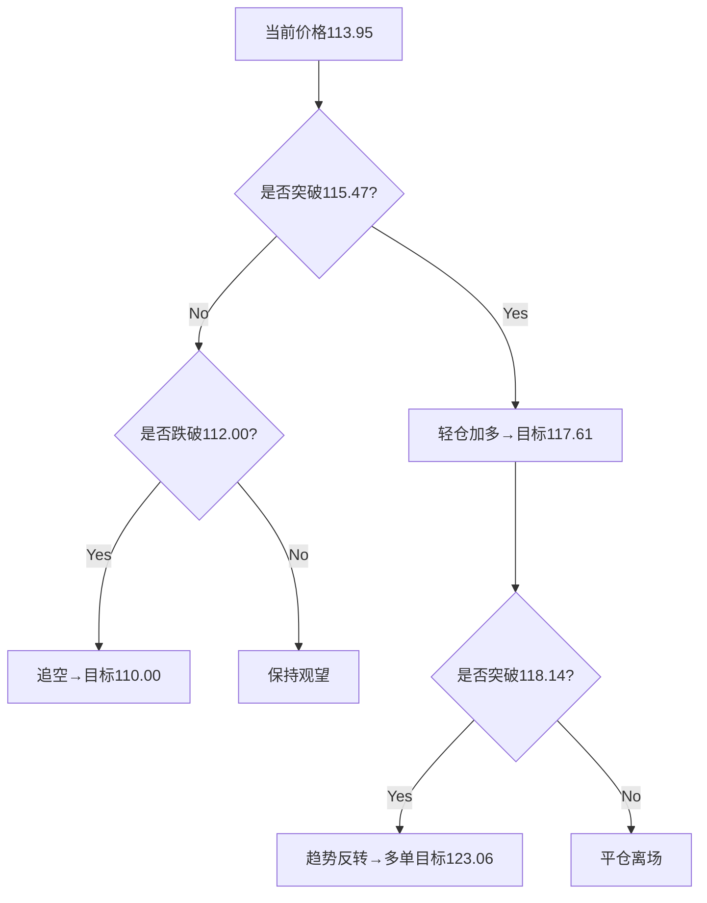

# 实时技术分析报告

## 📊 分析摘要
- 分析模型: deepseek-r1 (聚合分析)
- 最终建议: hold
- 置信度: 0

## 📈 详细分析
```markdown
# SOLUSDT 综合技术分析报告
**分析时间**：2026-01-30 07:30 UTC  
**当前价格**：$113.95 (-7.71% 24h)  
**分析模型**：deepseek & qwen  

---

## 🔄 模型观点对比分析
### 🧠 deepseek 核心观点
1. **趋势判断**  
   - 多周期共振下跌（4小时/1小时主导）  
   - 日线震荡偏空，未确认反转  
2. **关键信号**  
   - 三周期RSI超卖（15.23-29.14）  
   - 1小时MACD潜在底背离  
3. **操作建议**  
   - 观望为主，激进者轻仓试多  
   - 突破115.47确认入场  

### 🤖 qwen 核心观点
1. **趋势判断**  
   - 中期下跌趋势明确（4小时主导）  
   - 日线横盘增加不确定性  
2. **关键信号**  
   - MACD全面看空无金叉  
   - 成交量低迷削弱形态可靠性  
3. **操作建议**  
   - 优先等待反弹至117-118区间做空  
   - 保守者保持60%现金观望  

---

## ⚖️ 模型异同点对比
| 维度         | deepseek                          | qwen                              | 一致性 |
|--------------|-----------------------------------|-----------------------------------|--------|
| **趋势方向** | 短期超卖但未反转                 | 中期下跌趋势延续                 | 中     |
| **RSI解读**  | 超卖共振→反弹概率高              | 存在反弹需求但需确认             | 高     |
| **MACD解读** | 1小时动能衰减→背离机会           | 全线死叉→空头主导                | 低     |
| **关键阻力** | 115.47（1小时前高）              | 118.14（4小时结构破位点）        | 中     |
| **核心策略** | 轻仓试多                         | 反弹做空                         | 低     |

> 💡 **关键分歧点**：MACD解读与多空方向选择  
> 💡 **共同预警**：价格跌破112将加速下行  

---

## 📊 综合分析结论
1. **趋势状态**  
   - ✅ **中期趋势**：4小时下降通道明确（高点118.14→116.10）  
   - ⚠️ **短期信号**：三周期RSI超卖+价格触布林下轨→技术反弹概率≥60%  
   - ⚠️ **矛盾点**：MACD死叉延续 vs RSI超卖修复需求  

2. **关键价位验证**  
   - **强支撑区间**：112.04-112.50（日线布林下轨+心理关口）  
   - **强弱分界线**：115.47（1小时结构破位点）  
   - **趋势反转点**：118.14（4小时下降通道上轨）  

3. **量能验证**  
   - 24h成交量仅$491万 → 需放量阳线确认反弹有效性  

---

## 💡 综合交易建议
### 🎯 核心策略：**突破确认交易**
**推荐场景**（按风险偏好排序）：  
1. **保守策略**  
   - 保持80%现金观望  
   - 突破118.14追多（止损115.00）  
   - 跌破112.00追空（止损114.00）  

2. **平衡策略**  
   - 现价113.95轻仓试多（≤3%仓位）  
   - 止损111.80（日线布林下轨下方）  
   - 目标1：115.47（平仓30%）  
   - 目标2：117.61（平仓50%）  

3. **激进策略**  
   - 挂限价空单117.50（≤5%仓位）  
   - 止损119.00（4小时前高上方）  
   - 目标112.00→110.00  

### 📍 关键执行参数
| 策略类型 | 入场点       | 止损位   | 止盈位               | 仓位占比 |
|----------|--------------|----------|----------------------|----------|
| 多头     | 现价113.95   | 111.80   | 115.47→117.61        | ≤3%      |
| 突破多   | 116.00       | 114.00   | 118.14→123.06        | ≤5%      |
| 空头     | 117.50       | 119.00   | 112.00→110.00        | ≤5%      |
| 突破空   | 111.90       | 113.50   | 110.00→105.00        | ≤3%      |

> ✳️ **仓位公式**：  
> 风险金额 = 账户余额 × 1%  
> 合约数量 = 风险金额 / (入场价-止损价)  

---

## ⚠️ 风险收益评估
| 策略      | 最大风险 | 潜在收益 | 风险收益比 |
|-----------|----------|----------|------------|
| **轻仓多**| 1.8%     | 3.2%     | 1:1.78     |
| **突破多**| 1.7%     | 6.0%     | 1:3.53     |
| **反弹空**| 1.3%     | 4.8%     | 1:3.69     |
| **突破空**| 1.4%     | 5.4%     | 1:3.86     |

**主要风险提示**：  
1. 流动性陷阱：超卖后继续阴跌（概率≈35%）  
2. 假突破：成交量不足导致关键位反复测试（概率≈40%）  
3. 外部冲击：缺少资金费率/持仓量数据，无法预判大户动作  

---

## 📌 最终决策指南


> 🔑 **关键风控原则**：  
> - 单笔损失≤总资金1%  
> - 美盘时段（UTC 14:30-21:00）避免开新仓  
> - 突破交易必须配合1.5倍平均成交量  
```

## 💡 交易建议
- 操作: hold
- 置信度: 0
- 分析理由: 无详细理由

## 🤖 模型详细结果
### deepseek
- 分析: ```markdown
# SOLUSDT 技术分析报告
**分析时间**：2026-01-30 06:54:51 UTC  
**当前价格**：$113.95 (-7.71% 24h)

---

## 📊 多时间框架趋势分析
1. **日线图（长期趋势）**  
   - 趋势方向：`sideways`（震荡），强度为0（无明确方向）  
   - 价格位于布林带下轨（112.04）附近，MA20（131.96）构成强阻力  
   - 连续3根阴线，显示长期抛压持续  

2. **4小时图（中期趋势）**  
   - 趋势方向：`down`（下跌），强度52.32（中等偏强）  
   - 价格低于MA20（123.06）和MA50（124.97），布林带下轨（114.26）被短暂突破  
   - 近5根K线中4根为阴线，中期下行趋势明确  

3. **1小时图（短期趋势）**  
   - 趋势方向：`down`（下跌），强度54.26（较强）  
   - 价格持续运行于MA20（117.61）下方，接近布林带下轨（112.07）  
   - 最近K线出现长下影线（低至113.01），暗示短期支撑  

4. **趋势一致性分析**  
   - 共振现象：4小时与1小时均显示下跌趋势，日线震荡偏空  
   - 背离信号：三时间框架RSI均超卖（日线21.92/4小时15.23/1小时29.14），与价格下跌形成极限背离  

5. **主导趋势判断**  
   - 中期（4小时）主导趋势为下跌，短期（1小时）加速探底  

---

## 🎯 关键价格位
| 类型          | 价格位（USD） | 依据                          |
|---------------|---------------|-------------------------------|
| **主要支撑**  | 112.04        | 日线布林带下轨                |
|               | 114.26        | 4小时布林带下轨               |
| **主要阻力**  | 123.06        | 4小时MA20 + 布林带中轨        |
|               | 131.96        | 日线MA20                      |
| **短期支撑**  | 113.01        | 1小时最近K线低点              |
| **短期阻力**  | 115.47        | 1小时最近阴线高点             |
| **关键突破位**| 111.00        | 心理整数关口+日线下轨下方空间 |

---

## 📈 技术信号解读
### RSI分析
- **日线**：21.92（超卖），创20周期新低  
- **4小时**：15.23（严重超卖），接近极端值  
- **1小时**：29.14（超卖），出现底背离雏形  
- **结论**：多周期超卖共振，反弹概率上升  

### MACD分析
- **日线**：柱状线-2.08，死叉持续但斜率趋缓  
- **4小时**：柱状线-1.18，加速下行中  
- **1小时**：柱状线-0.09，潜在底背离（价格新低而MACD回升）  
- **结论**：短期动能衰减暗示反弹可能  

### 均线系统
- 价格全面承压：  
  - 1小时：低于MA20/MA50  
  - 4小时：低于MA20/MA50  
  - 日线：低于MA20  
- 均线排列呈标准空头趋势（MA20>MA50）  

### 布林带分析
- 三周期价格均触及下轨，带宽扩张（4小时带宽17.6），波动率升高  

---

## 🔍 图表形态识别
1. **日线图**  
   - 潜在“三只乌鸦”形态（连续三阴线），但未确认  
   - 无明确经典反转形态  

2. **4小时图**  
   - 下降通道雏形（高点下移：118.14→116.10）  
   - 近期K线带长下影，暗示112-114区域有买盘  

3. **1小时图**  
   - 潜在“锤子线”形态（最近K线下影占实体70%）  
   - 未确认底部形态  

---

## 💡 交易建议
**推荐操作**：  
⚠️ 短期超卖严重，但趋势未反转 → **观望为主，激进者可轻仓试多**  

**入场条件**：  
1. 1小时收盘站上115.47（短期阻力）  
2. MACD金叉确认 + RSI突破30  

**入场区间**：  
- 保守：突破115.47后回踩114.50  
- 激进：113.00-114.00（带严格止损）  

**止损位**：  
- 111.00（日线下轨下方 + 心理关口）  

**止盈目标**：  
1. 短期：117.61（1小时MA20）  
2. 中期：123.06（4小时MA20）  

**仓位建议**：  
- 最大5%（总资产70.64 USDT → 约3.5 USDT）  
- 考虑佣金：taker 0.1%  

---

## ⚠️ 风险提示
1. **时间框架冲突**：  
   - 日线震荡 vs 中短期下跌 → 以4小时趋势为主导  

2. **波动性评估**：  
   - 1小时真实波幅均值≈1.5美元，止损需≥2倍波动  

3. **主要风险**：  
   - 流动性陷阱：超卖后继续阴跌  
   - 数据缺失：MA200/资金费率缺位影响判断  

4. **分析失效条件**：  
   - 价格跌破111并加速下行  
   - 4小时收盘站上123（趋势反转信号）  

```

```json
{
  "symbol": "SOLUSDT",
  "timestamp": "2026-01-30 06:54:51 UTC",
  "current_price": 113.95,
  "trend_summary": {
    "daily": "sideways",
    "4h": "down",
    "1h": "down",
    "consensus": "bearish"
  },
  "key_levels": {
    "support": [112.04, 114.26],
    "resistance": [123.06, 131.96],
    "short_term_support": 113.01,
    "short_term_resistance": 115.47
  },
  "technical_signals": {
    "RSI_status": "multi-timeframe oversold",
    "MACD_status": "bearish but weakening at 1h",
    "bollinger_band": "price at lower band on all timeframes"
  },
  "trading_recommendation": {
    "action": "watch/light long",
    "entry_zone": [113.00, 115.47],
    "stop_loss": 111.00,
    "take_profit": [117.61, 123.06],
    "position_size": "≤5%"
  },
  "risk_indicators": {
    "volatility": "high",
    "failure_conditions": ["close < 111", "close > 123 on 4h"]
  }
}
```
- 分析时间: 2026-01-30 14:55:39
- 响应时间: 48.27000000秒

### qwen
- 分析: # 📊 SOL/USDT 多时间框架技术分析报告  
**分析时间（UTC）：2026-01-30 06:54:51**  
**当前价格：$113.95**  

---

## 📊 多时间框架趋势分析

### **日线图（长期趋势）**
- **趋势方向**：横盘（sideways），强度为 0。
- **解读**：尽管近期连续三根阴线，但整体趋势未形成明确下行或上行。价格在布林带下轨（$112.04）附近获得支撑，MA20（$131.96）构成强阻力。
- **关键位**：
  - **支撑**：$112.04（布林带下轨）、$115.39（前低）
  - **阻力**：$125.51（近期高点）、$131.96（MA20）

### **4小时图（中期趋势）**
- **趋势方向**：下行（down），强度 52.32。
- **解读**：价格持续运行于 MA20（$123.06）和 MA50（$124.97）下方，呈现典型空头排列。布林带中轨（$123.06）为关键阻力，下轨（$114.26）提供短期支撑。
- **关键位**：
  - **支撑**：$114.26（布林带下轨）、$112.14（近期低点）
  - **阻力**：$118.14（近期高点）、$123.06（MA20/布林中轨）

### **1小时图（短期趋势）**
- **趋势方向**：下行（down），强度 54.26。
- **解读**：价格跌破 MA20（$117.61）和 MA50（$122.35），且位于布林带中轨（$117.61）下方，短期偏空。但已触及布林带下轨（$112.07），存在技术性反弹可能。
- **关键位**：
  - **支撑**：$112.07（布林带下轨）、$113.01（近期低点）
  - **阻力**：$115.47（前高）、$117.61（MA20/布林中轨）

### **趋势一致性分析**
- **日线 vs 4小时 vs 1小时**：
  - 日线为横盘，但4小时与1小时均显示明确下行趋势。
  - **无完全共振**：日线未确认下跌，但中期与短期一致看空。
  - **主导趋势判断**：以4小时图为主导（中期趋势），1小时图用于寻找反弹做空或超跌反弹机会。

---

## 🎯 关键价格位（多时间框架综合）

| 类型 | 价格（USDT） | 依据 |
|------|---------------|------|
| **主要支撑位** | $112.04 | 日线布林带下轨 |
| | $112.14 | 4小时近期低点 |
| **主要阻力位** | $118.14 | 4小时/日线近期高点 |
| | $123.06 | 4小时 MA20 / 布林中轨 |
| **短期支撑/阻力** | $112.07 / $115.47 | 1小时布林带下轨 / 前高 |
| **关键突破位** | $118.14（上破转多）<br>$112.00（下破加速下跌） | 多周期高/低点 + 布林带边界 |

---

## 📈 技术信号解读（多时间框架对比）

### **RSI分析**
- **1小时 RSI = 29.14** → 超卖（oversold）
- **4小时 RSI = 15.23** → 极度超卖
- **日线 RSI = 21.92** → 超卖
- **结论**：三个时间框架均处于超卖区域，**存在技术性反弹需求**，但需等待价格确认（如阳线放量）。

### **MACD分析**
- **1小时**：MACD (-2.24) < Signal (-2.14)，柱状图负值扩大 → 空头动能增强
- **4小时**：MACD (-2.57) << Signal (-1.39)，柱状图大幅负值 → 强空头趋势
- **日线**：MACD (-3.95) << Signal (-1.87)，柱状图深度负值 → 长期空头主导
- **结论**：MACD 全面看空，**无金叉迹象**，反弹可能仅为修正。

### **均线系统**
- 所有时间框架均线均呈**空头排列**（价格 < MA20 < MA50）。
- 日线 MA20（$131.96）为强阻力，4小时 MA20（$123.06）为中期阻力。

### **布林带分析**
- 价格在三个时间框架均贴近**布林带下轨**，波动率收缩，**变盘在即**。
- 若价格站回布林中轨，则短期趋势可能反转。

---

## 🔍 图表形态识别

### **日线图形态**
- 近期形成**三连阴**，但未跌破前低（$112.14），暂无明确形态（如头肩顶）。可视为**下跌中继**或**底部构筑初期**。
- **置信度**：低（需更多K线确认）

### **4小时图形态**
- 形成**下降通道**：高点下移（$123.34 → $119.96 → $118.14），低点下移（$116.12 → $112.14）。
- **置信度**：中高

### **1小时图形态**
- 最近5根K线呈现**窄幅震荡+下破**，类似“下降旗形”末端。
- **置信度**：中（需突破$112.07确认）

### **形态确认**
- **无显著量能配合**（24h成交量仅$491万，相对低迷），形态可靠性受限。
- **建议**：等待价格突破关键位后再确认形态。

---

## 💡 交易建议（基于多时间框架共振）

### **推荐操作**：**观望为主，激进者可轻仓试多（反弹做空）**

> **理由**：  
> - RSI极度超卖，存在反弹需求；  
> - 但MACD和趋势仍偏空，**不宜重仓做多**；  
> - 更佳策略是等待反弹至阻力位后做空。

### **入场条件**
- **做多（反弹）**：1小时图收于 $115.50 上方 + RSI > 40
- **做空（主策略）**：价格反弹至 $117.50–$118.00 区间 + 1小时图出现滞涨K线（如长上影、吞没）

### **入场区间**
- **做多**：$112.50 – $113.50（靠近布林下轨）
- **做空**：$117.00 – $118.00（4小时MA20下方）

### **止损位**
- **做多止损**：$111.80（跌破日线布林下轨）
- **做空止损**：$119.00（突破4小时高点）

### **止盈目标**
- **做多目标**：
  - T1: $115.50（1小时前高）
  - T2: $117.60（1小时MA20）
- **做空目标**：
  - T1: $112.00（心理关口 + 布林下轨）
  - T2: $110.00（延伸支撑）

### **仓位建议**
- **观望**：60% 资金
- **试多/试空**：单笔 ≤ 10% 总资产（$70.64 → ≤ $7）
- **理由**：趋势未明 + 超卖反弹风险 + 低成交量

---

## ⚠️ 风险提示

### **时间框架冲突**
- 日线横盘 vs 4H/1H 下行 → **以4H为主**，但需警惕日线突然反转。

### **当前市场波动性评估**
- 1小时ATR估算 ≈ $2.5（基于近期高低点），波动适中。
- 但成交量偏低（$491万/24h），**流动性风险较高**，滑点可能较大。

### **需警惕的主要风险**
1. **指标失效**：RSI超卖后可能继续下行（“钝化”现象）。
2. **外部事件**：无资金流数据，无法判断大资金动向。
3. **佣金影响**：maker/taker费率为0.1%，短线交易成本显著（尤其高频）。

### **分析失效条件**
- **价格 > $118.14**：打破4小时下降结构，转为震荡偏多。
- **价格 < $112.00**：加速下跌，原支撑失效，目标下看$105–$100。
- **RSI回升至50以上 + MACD金叉**：多头信号确认。

---

## ✅ 结论
当前SOL/USDT处于**中期下跌 + 短期超卖**状态。  
**最佳策略**：等待价格反弹至$117–$118区间后做空，止损$119，目标$112/$110。  
**保守策略**：观望至日线方向明确（突破$125或跌破$112）。

---

```json
{
  "symbol": "SOLUSDT",
  "analysis_time_utc": "2026-01-30T06:54:51Z",
  "current_price": 113.95,
  "trend_analysis": {
    "daily": {
      "direction": "sideways",
      "strength": 0,
      "support": [112.04, 115.39],
      "resistance": [125.51, 131.96]
    },
    "four_hour": {
      "direction": "down",
      "strength": 52.31861916,
      "support": [114.26, 112.14],
      "resistance": [118.14, 123.06]
    },
    "one_hour": {
      "direction": "down",
      "strength": 54.25605442,
      "support": [112.07, 113.01],
      "resistance": [115.47, 117.61]
    },
    "consensus": "4H and 1H bearish; daily neutral. Medium-term downtrend dominates."
  },
  "key_levels": {
    "major_support": [112.04, 112.14],
    "major_resistance": [118.14, 123.06],
    "short_term_support": 112.07,
    "short_term_resistance": 115.47,
    "breakout_levels": {
      "bullish": 118.14,
      "bearish": 112.0
    }
  },
  "technical_signals": {
    "rsi": {
      "one_hour": 29.14,
      "four_hour": 15.23,
      "daily": 21.92,
      "interpretation": "All timeframes oversold; rebound likely but not confirmed."
    },
    "macd": {
      "one_hour": { "macd": -2.237, "signal": -2.143, "histogram": -0.094 },
      "four_hour": { "macd": -2.567, "signal": -1.390, "histogram": -1.177 },
      "daily": { "macd": -3.951, "signal": -1.874, "histogram": -2.077 },
      "interpretation": "Strong bearish momentum across all timeframes; no bullish crossover."
    },
    "moving_averages": "Price below MA20 and MA50 on all available timeframes; bearish alignment.",
    "bollinger_bands": "Price near lower band on all timeframes; low volatility, potential for breakout."
  },
  "chart_patterns": {
    "daily": "No clear pattern; possible bottoming or continuation.",
    "four_hour": "Descending channel (moderate confidence).",
    "one_hour": "Potential descending flag (low confidence).",
    "confirmation": "Low volume reduces reliability; wait for price confirmation."
  },
  "trading_recommendation": {
    "action": "Watch or light short on rally",
    "entry_conditions": {
      "long": "Price > 115.50 and RSI > 40 on 1H",
      "short": "Price rejection at 117.00–118.00 with bearish candle"
    },
    "entry_zone": {
      "long": [112.5, 113.5],
      "short": [117.0, 118.0]
    },
    "stop_loss": {
      "long": 111.8,
      "short": 119.0
    },
    "take_profit": {
      "long": [115.5, 117.6],
      "short": [112.0, 110.0]
    },
    "position_size": "≤10% of capital per trade; 60% cash recommended"
  },
  "risk_warnings": {
    "timeframe_conflict": "Daily neutral vs 4H/1H bearish — prioritize 4H trend.",
    "volatility": "Moderate ATR (~2.5), but low volume increases slippage risk.",
    "key_risks": [
      "RSI oversold but can remain so",
      "No funding or OI data to confirm sentiment",
      "0.1% fees impact short-term profitability"
    ],
    "invalidation_conditions": [
      "Close above 118.14 invalidates bearish structure",
      "Close below 112.00 confirms bearish acceleration",
      "RSI > 50 + MACD bullish crossover on 4H"
    ]
  }
}
```
- 分析时间: 2026-01-30 14:56:12
- 响应时间: 80.69000000秒

## ⚠️ 风险分析
- 市场风险: 加密货币市场波动较大，请谨慎交易
- 模型风险: AI模型分析基于历史数据，可能无法预测突发市场事件
- 执行风险: 交易执行价格可能与分析时的价格存在差异

## 📝 交易策略建议
1. **资金管理**: 建议使用不超过总资金20%的资金进行单笔交易
2. **止损设置**: 建议设置5-10%的止损位，控制单笔交易风险
3. **止盈设置**: 建议设置15-30%的止盈位，确保收益
4. **仓位管理**: 根据市场波动性调整仓位大小
5. **监控频率**: 建议至少每4小时监控一次交易情况

## 📄 免责声明
本分析报告仅供参考，不构成任何投资建议。
交易决策请结合个人风险承受能力和市场实际情况。
过往表现不代表未来结果，投资有风险，入市需谨慎。